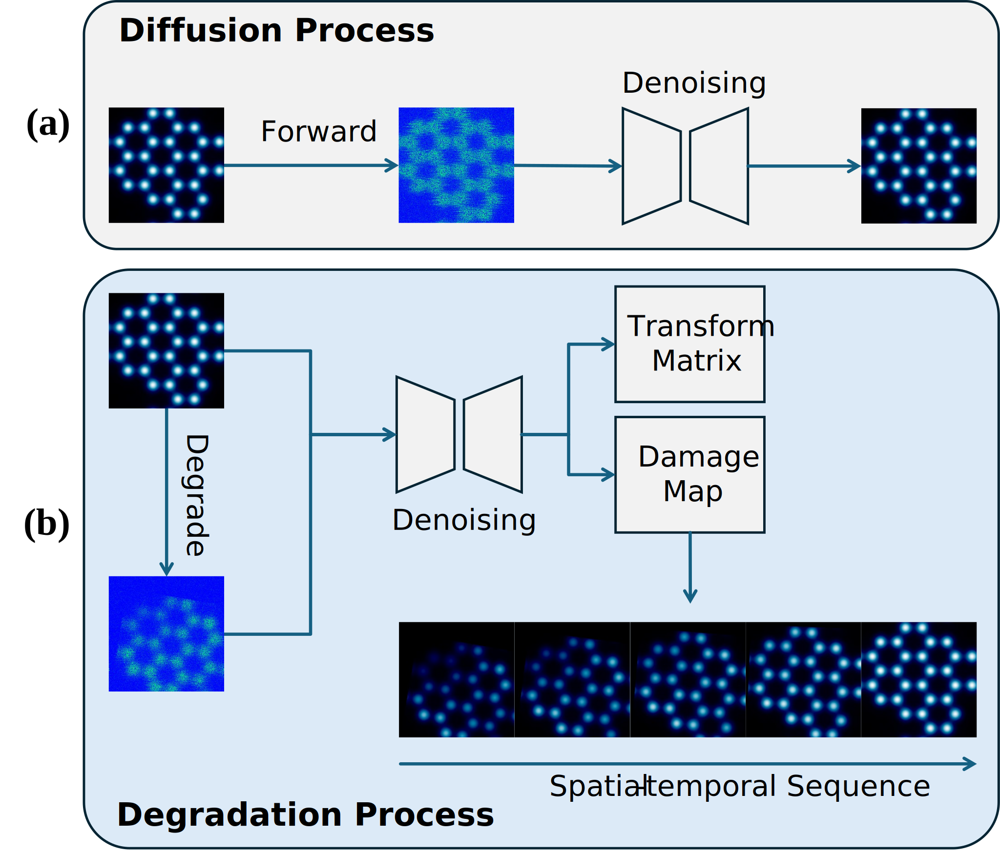
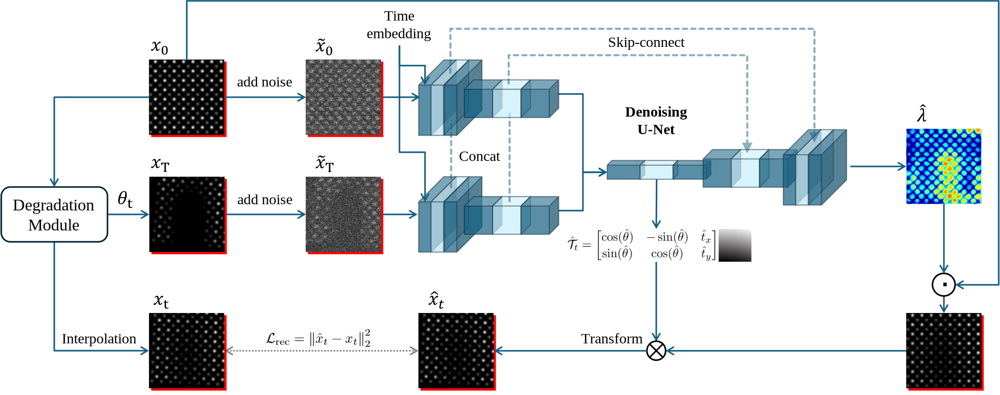
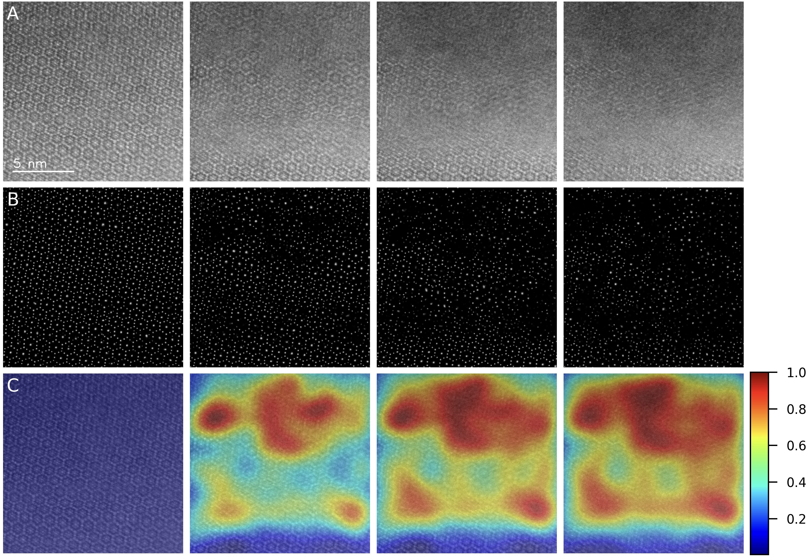
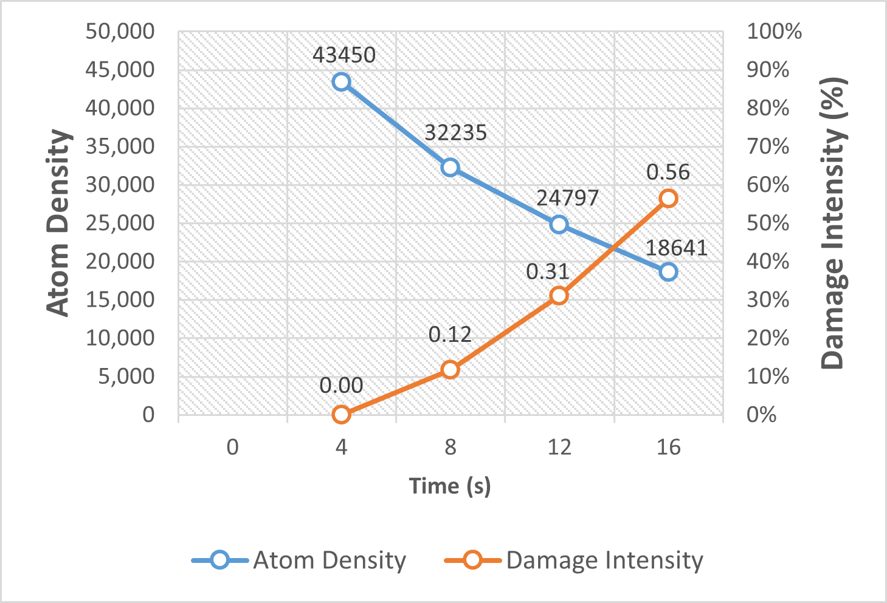

# NEW: AtomDiffuser: Time-Aware Degradation Modeling for Drift and Beam Damage in STEM Imaging
See our paper at the ICCV 2025: 
<a href="../files/Poster_hao9_ICCV_2025.pdf" target="_blank">BSN 2024 Poster</a> 
/ 
<a href="https://openaccess.thecvf.com/content/ICCV2025W/CV4MS/html/Wang_AtomDiffuser_Time-Aware_Degradation_Modeling_for_Drift_and_Beam_Damage_in_ICCVW_2025_paper.html" target="_blank">Paper</a>


See our project page for the practical implementation and testing:
<a href="https://github.com/AIS-Clemson/atom_diffuser" target="_blank">AIS-Clemson/AtomDiffuser</a>
 
## Project Overview
Scanning transmission electron microscopy (STEM) plays a critical role in modern materials science, enabling direct imaging of atomic structures and their evolution under external interferences. However, interpreting time-resolved STEM data remains challenging due to two entangled degradation effects: spatial drift caused by mechanical and thermal instabilities, and beam-induced signal loss resulting from radiation damage. These factors distort both geometry and intensity in complex, temporally correlated ways, making it difficult for existing methods to explicitly separate their effects or model material dynamics at atomic resolution.

<div align="center">
    
</div>

In this work, we present AtomDiffuser, a time-aware degradation modeling framework that disentangles sample drift and radiometric attenuation by predicting an affine transformation and a spatially varying decay map between any two STEM frames. Unlike traditional denoising or registration pipelines, our method leverages degradation as a physically heuristic, temporally conditioned process, enabling interpretable structural evolutions across time. Trained on synthetic degradation processes, AtomDiffuser also generalizes well to real-world cryo-STEM data. It further supports high-resolution degradation inference and drift alignment, offering tools for visualizing and quantifying degradation patterns that correlate with radiation-induced atomic instabilities.
<br> 

<div align="center">
    
</div>

Our paper is accepted by 
<a href="https://sites.google.com/view/cv4ms-iccv-2025" target="_blank">ICCV 2025 CV4MS Workshop</a>

 
### Acknowledgements:
Please cite our work if you find this project helpful.
```bibtex
@InProceedings{Wang_2025_ICCV,
    author    = {Wang, Hao and Zheng, Hongkui and He, Kai and Razi, Abolfazl},
    title     = {AtomDiffuser: Time-Aware Degradation Modeling for Drift and Beam Damage in STEM Imaging},
    booktitle = {Proceedings of the IEEE/CVF International Conference on Computer Vision (ICCV) Workshops},
    month     = {October},
    year      = {2025},
    pages     = {3631-3640}
}
```

<br>
<br>
<br>


# (2025) Gaussian Differential Assessment of Sequential STEM Radiation Damage in Beam-Sensitive Materials

## Project Overview
Electron beam-induced damage poses a major challenge to high-resolution imaging of beam-sensitive materials in transmission electron microscopy (TEM). To enable precise, quantitative assessment of radiation damage in sequential cryo-STEM imaging, we present a novel framework that integrates deep learning-based atomic localization with physics-informed Gaussian modeling. By leveraging a pre-trained U-Net from AtomSegNet, we extract atomic-column positions from HAADF-STEM image sequences of garnet-type Li₇La₃Zr₂O₁₂ (LLZO) solid electrolytes under cryogenic conditions. These atomic coordinates are converted into smoothed atomic density maps via Gaussian functions, allowing the computation of pixel-wise differential maps that capture fine-scale structural evolution across frames. Damage quantification is achieved through intensity-based analysis of these differential maps, revealing a linear correlation between atomic density loss and radiation exposure. Our method surpasses conventional CNN-based feature extraction approaches in spatial resolution and robustness to atomic drift, offering a reliable tool for precise, frame-by-frame quantification of beam-induced structural degradation in sensitive materials.
<br> 

<div align="center">
    
</div>

<div align="center">
    
</div>

Our abstract is accepted by 
<a href="https://mmconference.microscopy.org/" target="_blank">Microscopy & Microanalysis 2025</a>
 
### Acknowledgements:
Please cite our work if you find this project helpful.
```bibtex
@article{zheng2025gaussian,
  title={Gaussian Differential Assessment of Sequential STEM Radiation Damage in Beam-Sensitive Materials},
  author={Zheng, Hongkui and Wang, Hao and Chen, Xiwen and Razi, Abolfazl and He, Kai},
  journal={Microscopy and Microanalysis},
  volume={31},
  number={Supplement\_1},
  pages={ozaf048--1065},
  year={2025},
  publisher={Oxford University Press US}
}
```

<br>
<br>
<br>


# Project Team
## PI: Dr. Abolfazl Razi [arazi@clemson.edu](mailto:arazi@clemson.edu)

## Graduate Students:
-	Hao Wang
-   Xiwen Chen

## Acknowledgements:
-   Dr. Kai He (University of California, Irvine)
-   Hongkui Zheng (University of California, Irvine)

<br>
<br>
<br>

