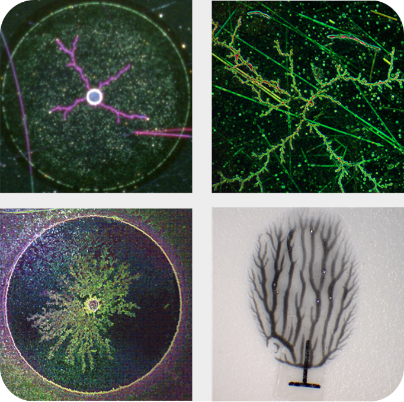
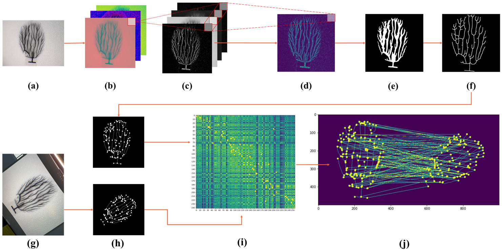
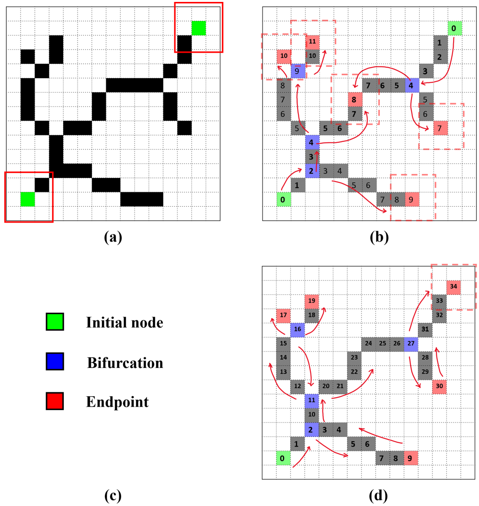
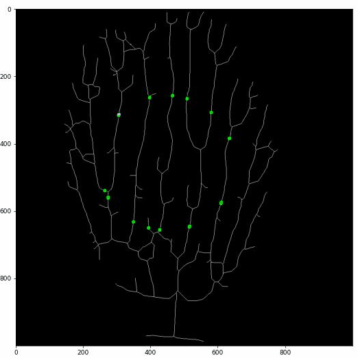
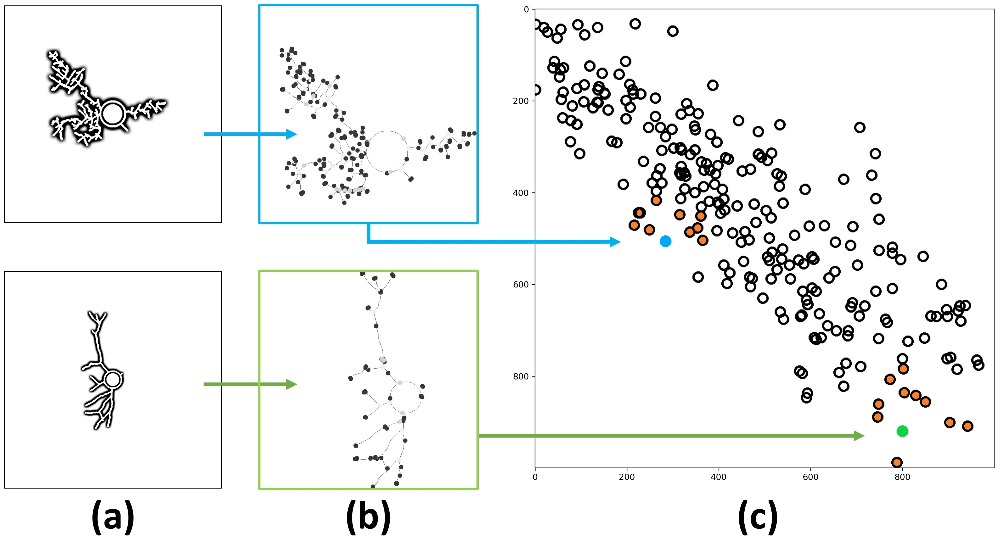
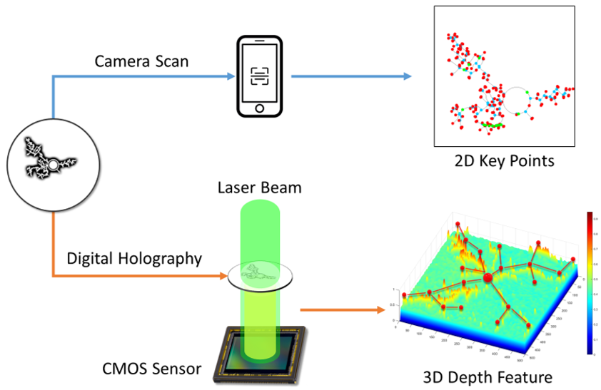
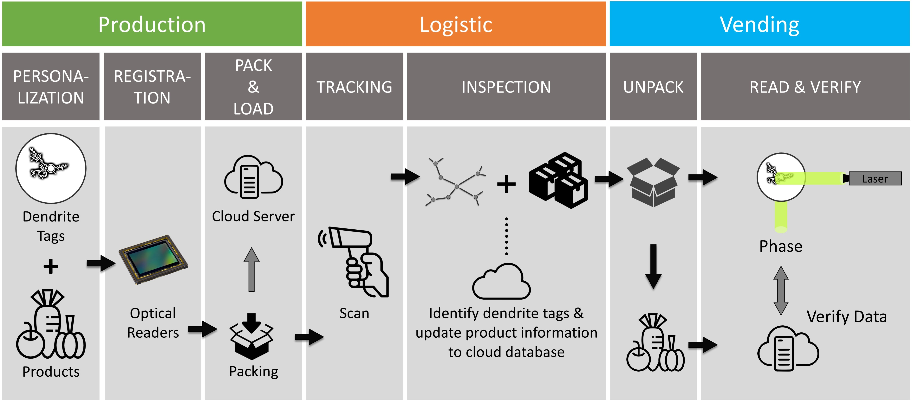

# Project Overview

We present a solution for secure monitoring in supply chains with nano-resolution visual identifiers-based cyber-physical systems.
In this project, nano-reoslution samples are used for identification and authentication process. 

The dendritic samples are electro-chemical generated nano-materials and is customizable in terms of scale and morphology complexity. 

Compare to the conventional barcode or QR code-based methods, our solution provide high-level security due to the randomness and high entropy information of dendritic samples. Meanwhile, our computer vision-based algorithm provides a competitive computation cost.

To extract the information from dendritic samples, we apply a sequence of feature extraction process that using spatial filters and frequency filters to obtain low-frequency information.

Then we apply our proposed fast key points extraction algorithm to get the feature points that can represent the original graph.

Specifically, we apply multiple sliding windows to traverse the graph and store the key points information. 

The implementation of multiple-sliding window can greatly boost the searching efficiency.

Similar to the facial recognition, each dendritic pattern have a unique ID, and different patterns tend to have different location in feature space. This non-inverse process can accelerate the searching speed, while prevent the hard-decoding from external cyber-attacks.

While the key points information can be extracted from the 2D images, richer information such as depth and phase can be retrival from another advanced optical photography method, which is Digital Holograph (DH). 

Digital Holograph is used to recover the phase information of samples. In order to generate the phase information, we apply Digital In-line Holography (DIH) to the real samples, and obtain the generated hologram from a regular CMOS. 

Through deep learning-based methods, the phase information can successfully been reconstructed from the hologram. 

To apply the implemented methods into the supply systems, we developed our cloud-based management interface, which can be accessed from multiple platforms such as mobile phone, tablet, and desktop.

To further integrate with supplyers and vendors, we initiated massive production according to the requirements of different products and delivery purposes. 

We are also working on the security improvement using adversarial learning methods to reduce the risks of cyber-attack from different dimensions. 

For the demonstration of this project, please see <a href="">this link</a>

# Citation

Recommended citation: 

Wang, H., Chen, X., Razi, A., Kozicki, M., Amin, R. and Manfredo, M., 2022. Nano-Resolution Visual Identifiers Enable Secure Monitoring in Next-Generation Cyber-Physical Systems. arXiv preprint arXiv:2211.08678.

@article{wang2022nano,
  title={Nano-Resolution Visual Identifiers Enable Secure Monitoring in Next-Generation Cyber-Physical Systems},
  author={Wang, Hao and Chen, Xiwen and Razi, Abolfazl and Kozicki, Michael and Amin, Rahul and Manfredo, Mark},
  journal={arXiv preprint arXiv:2211.08678},
  year={2022}
}