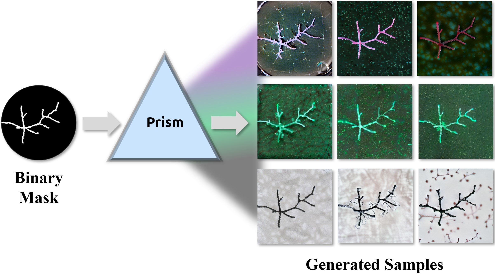
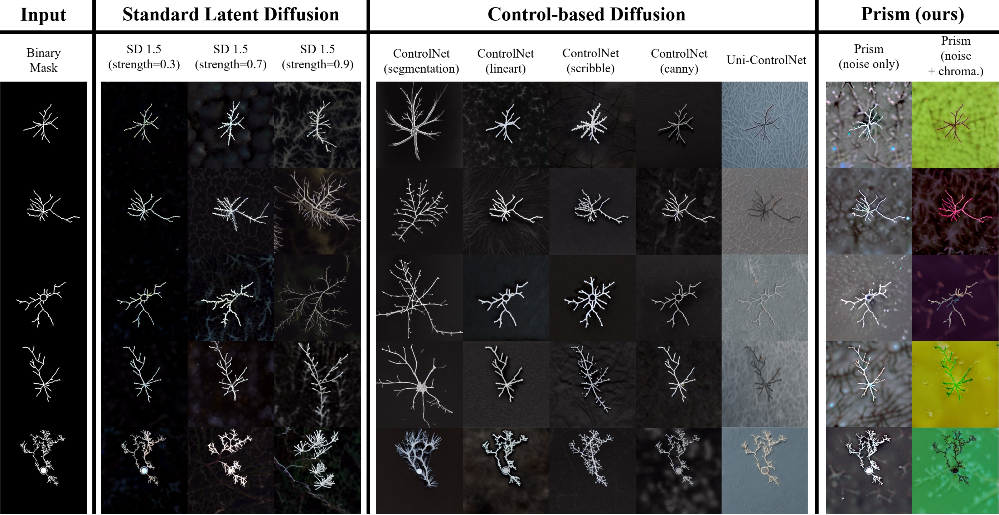
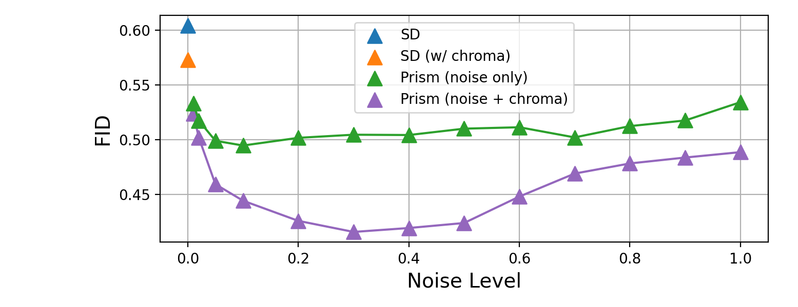

 

# Diffusion Prism: Enhancing Diversity and Morphology Consistency in Mask-to-Image Diffusion

News: This paper is accepted by the [WACV 2024 4th Workshop on Image/Video/Audio Quality in Computer Vision and Generative AI](https://wacv2025-image-quality-workshop2.github.io/index.html)

For more details, visit the project page: [GitHub - Diffusion Prism](https://github.com/AIS-Clemson/diffusion_prism).

## Introduction

Diffusion Prism is a training-free framework that efficiently transforms binary masks into realistic and diverse samples while preserving morphological features. We explored that a small amount of artificial noise will significantly assist the image-denoising process. To prove this novel mask-to-image concept, we use nano-dendritic patterns as an example to demonstrate the merit of our method compared to existing controllable diffusion models. We also extend the proposed framework to other biological patterns, highlighting its potential applications across various fields. 

## Sample Dataset

<!--  -->

- **Dataset:** Download from [Google Drive]()

## Key Features

- **Training-Free Diffusion Framework:** Generates images from binary skeletons without the need for model training or fine-tuning.
- **Diverse Backgrounds:** Creates images with varied and realistic backgrounds, enhancing model generalizability.

## Methodology

<!--  -->

**Diffusion Process:**
   - Combines masks with controllable noise, processed through a Variational Autoencoder (VAE) to generate latent variables.
   - The denoising U-Net refines these variables to produce realistic images guided by text prompts.

## Experimental Results

<!--  -->

- **High-Quality:** Lowest FID score compared to other methods, indicating better realistic styles.
- **Consistency:** Morphology preserving, the skeleton shape is well-kept in synthesized images.

<!--  -->

For more details, visit the [Project Page](https://arazi2.github.io/aisends.github.io/project/Prism).

# Citation 
<a href="https://arxiv.org/abs/2501.00944">Diffusion Prism: Enhancing Diversity and Morphology Consistency in Mask-to-Image Diffusion

@article{wang2025diffusion,
  title={Diffusion Prism: Enhancing Diversity and Morphology Consistency in Mask-to-Image Diffusion},
  author={Wang, Hao and Chen, Xiwen and Bastola, Ashish and Qin, Jiayou and Razi, Abolfazl},
  journal={arXiv preprint arXiv:2501.00944},
  year={2025}
}

## Related work:

<a href="https://arxiv.org/abs/2403.03463">FLAME Diffuser: Wildfire Image Synthesis using Mask Guided Diffusion</a>

 
 
 
 

# Contributing
This project is contributed by: 

<a href="hao9@g.clemson.edu">Hao Wang</a>

<a href="xiwenc@g.clemson.edu">Xiwen Chen</a>

<a href="abastol@g.clemson.edu">Ashish Bastola</a>

<a href="jiayou@mytracker.ai">Jiayou Qin</a>

<a href="arazi@clemson.edu">Abolfazl Razi</a>

