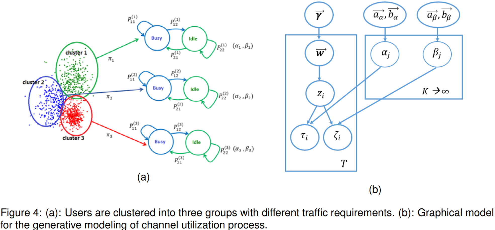
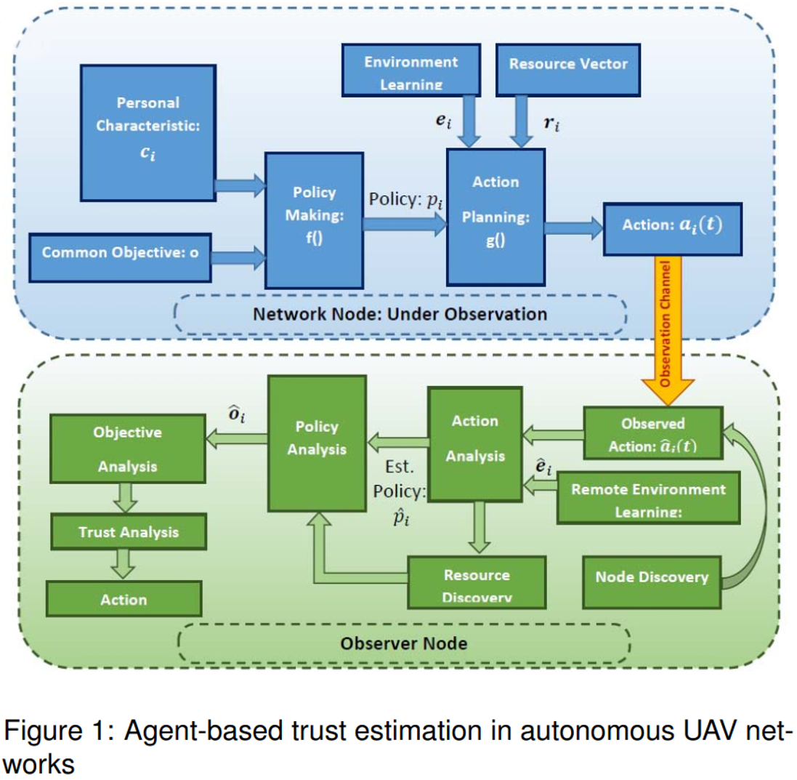

 

# Project Synopsis

This project aims to implement an inverse learning framework for Autonomous Vehicles (AVs) for motion-based anomaly detection by modeling and discovering the target decision-making process. we consider the mobility of AVs as a key example of AI-based action planning and aim to identify suspicious activities taken by intruding nodes.

# NSF Project Number #2204721

**Abstract:** The use of unmanned aerial vehicles (UAVs) has become commonplace in many applications nowadays. Like many other technologies, UAVs brings comfort and efficiency to the current practice in many applications while posing threats and safety issues. This project will advance the frontier of science in developing safer and more reliable aerial monitoring platforms while offering privacy and safety. Towards this goal, this project aims to make accurate predictions in UAV networks, by using ** Inverse Learning** techniques, so as to enable safer and more efficient operations.

A smart observation system will be developed to constantly monitor the behavior of autonomous agents to identify suspicious activities by measuring their deviation from the most rational behavior under given conditions. The proposed research includes several steps: (i) to develop mechanisms to simulate the target node's perception of its surrounding environment (i.e., seeing the word from the target's eyes) using deep learning methods, (ii) to predict its rational behavior(s) under given conditions and available resources by modeling the target's decision making procedure through inverse learning (reading the target's brain), and (iii) to measure the level of trust by detecting rare but critical episodes of deviating from its expected rational behavior. In particular, the mobility of UAVs and their networking activities will be investigated as two important scenarios of malicious activities. This project is expected to result in developing new tools and algorithms for the action analysis of smart nodes that will be shared with the research community.

The following are some Activites/Products of this Research.

## Research Tasks 1: Mobility Prediction and Profiling
  Develop a unified framework for mobility prediction while offering sufficient flexibility to consider class-specific properties for both aerial and ground unmanned vehicles (UAV/UGV). Our approach integrates model-based kinematics equations with a learning-based data-driven generative mode to enable online learning of class-specific motion capabilities with adaptive processing. Our method addresses the three largely overlooked properties of current methods, including (i) considering class-specific motion properties, (ii) addressing mixed traffic in the presence of human-controlled and Al-based autonomous vehicles, and (iii) addressing rare but informative events.

  
  
 
For more information read this [Article] (https://ieeexplore.ieee.org/stamp/stamp.jsp?arnumber=8533579) 

[//]: #  

## Research Tasks 2: Perception and Collective Learning Under Imperfect Communication
We develop optimal data aggregation methods for Autonomous Vehicles (AVs) under dynamic environments, by predicting the motion of surrounding vehicles. This project involved developing AI-based scheduling and cooperative perception algorithms for autonomous vehicles and supporting infrastructure. The AI-based scheduling aims to collect data from roadside units (RSUs) to develop learning-based models while accommodating the requirements of dynamic network topology and networking constraints. Our approach to this problem is imposing fairness on class labels (instead of node resources) that enhance the quality of developed models by enhancing the diversity of collected data. We use game theoretic optimization to solve the resulting non-linear non-convex problem. The work opens a new avenue to develop federated learning applications among drones and AVs while meticulously addressing the networking constraints in terms of available channel bandwidth and affordable delay. The preliminary results of this research are published in the 48th IEEE Conference on Local Computer Networks (LCN). 

For more information read this [Article] (https://ieeexplore.ieee.org/stamp/stamp.jsp?arnumber=10223373)

## Research Tasks 3: Cooperative Perception
To enable better perception of Environment, we are working to develop cooperative perception algorithm, where different vehicles share their cameras to extend their visual range. 

 
This is an in-progress work and the early results will appear on Asilomar Conference on Signals Systems and Computers, 2023.

## Research Task 4: Daviesity-Maximizing Data Accumulation
The broaden the impact of this project to a more general setup of federated learning among autonomous vehicles, the second student is tasked to develop a theoretical foundation for diversity-maximizing data aggregation from autonomous nodes under uncertain networking environments. To this end, we developed a new framework that integrates rate-distortion (RD) theory with determinantal point processes (DPP) to develop a diversity-enhancing data aggregation policy for unmanned ground and aerial vehicles (UGV/UAV) that enhances the quality of deep learning algorithms under federate learning paradigm.  The core idea is to gather imagery from distributed data sets among UAV/UGV nodes that collectively best represent the geometrical features of the entire data set. 

This is an in-progress work and the early results will are presented in this [Preprint] (https://arxiv.org/pdf/2306.02497.pdf) and [Preprint] (https://arxiv.org/pdf/2306.02497.pdf). 

## Research Taks 5: Networking Under Predicted Topology
A Key objective of this project is utilizing the predicted network topology and channel conditions to enhance networking efficiency (Al-based networking). To this end, we implemented an application-oriented data-centric communication framework for drones operate using WiFi and LTE communications in collaboration with MIT-Lincoln Lab.

For more details, read [this paper] (https://ieeexplore.ieee.org/stamp/stamp.jsp?arnumber=10060823)

## Research Taks 6: Acutator Trajectory Planning
We made some initial tests on extending the trajectory planning for actuator UAVs taht onclude overhead manipulators. The goal is to develop RL algorithms to achive a desired tip trajectory for a given base trajectory.

Preliminary results can be found in [this paper presented in SwarmNet 2023 Workshop] (https://arxiv.org/pdf/2308.12843.pdf)

 
 
 

# Project Activities

## Task 3
  In order to implement the developed protocols in more realistic setups and investigate their performance in real-world conditions, we implemented an application-oriented data-centric communication framework for drones operate using WiFi and LTE communications in collaboration with MIT-Lincoln Lab that resulted in a paper in the IEEE 20th Consumer Com Consumer Communications & Networking Conference (CCNC). 

## Task 4
  We also included two new undergraduate students to simulate the testing scenarios in simulation environments, including Carla (for AVs), and Microsoft AirSIM (for drones). These two students already graduated. We requested REU supplement funding to include two new undergraduate students in the coming year. We appreciate NSF for approving our requests. Currently, I am in the process of identifying and recruiting new two qualified students to work on implementing test scenarios in simulation environments and drone platforms to validate our previous research results and explore new research problems. 

### Beyond the developed activities, we further extended the activities by developing trajectory planning for drones equipped with overhead manipulators, with preliminary results published at the PiMRC conference. 

 
 
 

** Goal 2
The second goal of our project is to develop a reverse engineering framework that monitors the environment and target's actions to discover its decision-making strategy, as a baseline to identify deviations from predicted behavior. The challenges include projecting the observer's perception of the environment to the target's perspective (seeing the world from the target's eyes), determining the target's ultimate goal and reward-generation process (reading the agent's brain), and including potentially unknown factors in the decision-making strategy.

 

# Significant Results
We are delighted that our activities resulted in several high-quality papers (4 accepted and 2 under review). The key achievement of our activities in the last year was bridging two independent research paradigms based (RD) on rate-distortion theory and determinantal point processes (DPP) which provides a mathematical foundation to assess the quality of defeated learning applications for autonomous ground and aerial vehicles. This work is completed for unconstrained networking, and we are working toward addressing constrained networking and dynamic conditions. We also have implemented an optimization framework by imposing fairness on class labels (instead of network resources) and using game theoretic optimization that implicitly promotes diversity among aggregated data batches. Beyond our planned activities and to broaden the impacts of the developed research, we explore new extensions by integrating the developed networking protocols with trajectory design for actuator drones and also to extend the developed strategies to secure networking in the supply chain. The preliminary results of these new dimensions are presented at two IEEE conferences (CCSI, and CCNC). 

 
 
 

# Project Team

## PI: Dr. Abolfazl Razi [arazi@clemson.edu](mailto:arazi@clemson.edu)

## Graduate Students:
- Xiwen Chen
-	Hao Wang
-	Ahmad Sarlak
-	Niloufar Mehrabi
-	Arnau Rovira Sugranes (Graduated)

## Undergraduate Students:
-	William Bain (Graduated)
-	Michel Elrod
-	Rayid Alimasoo
-	John Suchanek

 
 
 

# Outcomes
The following papers are the outcome of completing this project. 4 accepted, 1 under review, and 1 in preparation.

## A PhD dissertation titled "Predictive Communications for UAVs" by Arnau Rovira-Sugranes, who was supported by this project.

## Journal articles:
  - Razi, A., Chen, X., Li, H., Wang, H., Russo, B., Chen, Y., & Yu, H. (2022). Deep learning serves traffic safety analysis: A forward‐looking review. IET Intelligent Transport Systems.

  - Qu, J., Tang, C., Zhang, Y., Zhou, K., & Razi, A. (2022). Long‐time target tracking algorithm based on re‐detection multi‐feature fusion. IET Cyber‐Systems and Robotics, 4(1), 38-50.

  - Rovira-Sugranes, A., Razi, A., Afghah, F., & Chakareski, J. (2022). A review of AI-enabled routing protocols for UAV networks: Trends, challenges, and future outlook. Ad Hoc Networks, 130, 102790.

  - Chen, X., Wang, H., Razi, A., Russo, B., Pacheco, J., Roberts, J., ... & Head, L. (2022). Network-level Safety Metrics for Overall Traffic Safety Assessment: A Case Study. Submitted to IEEE Access, 2022

  -  Rovira-Sugranes, A., Afghah, F., Qu, J., & Razi, A. (2021). Fully-echoed q-routing with simulated annealing inference for flying Ad Hoc networks. IEEE Transactions on Network Science and Engineering, 8(3), 2223-2234.

## Conference Proceedings:
  - Li, H., Wu, H., Chen, X., Wang, H., & Razi, A. (2021, August). Towards boosting channel attention for real image denoising: Sub-band pyramid attention. In International Conference on Image and Graphics (pp. 303-314). Springer, Cham, 2021.

  -  Qu, J., Zhang, Y., Zhou, K., & Razi, A. (2021, September). Long-Time Target Tracking Algorithm Based on Multi Feature Fusion and Correlation Filtering. In 2021 4th International Conference on Artificial Intelligence and Pattern Recognition (pp. 29-35), 2021.

  - Chen, X., Li, H., Qu, J., & Razi, A. (2021, January). Boosting Belief Propagation for LDPC Codes with Deep Convolutional Neural Network Predictors. In 2021 IEEE 18th Annual Consumer Communications & Networking Conference (CCNC) (pp. 1-6). IEEE.
  
  -	Sarlak, Ahmad, Abolfazl Razi, Xiwen Chen, and Rahul Amin. "Diversity Maximized Scheduling in RoadSide Units for Traffic Monitoring Applications." In 2023 IEEE 48th Conference on Local Computer Networks (LCN), 1-4. IEEE, 2023.

  -	Wang, Hao, Xiwen Chen, Abolfazl Razi, Michael Kozicki, Rahul Amin, and Mark Manfredo. "Nano-Resolution Visual Identifiers Enable Secure Monitoring in Next-Generation Cyber-Physical Systems." In 2022 International Conference on Computational Science and Computational Intelligence (CSCI). DOI 10.1109/CSCI58124.2022.00227, 2022.

  -	Alzorgan, Hazim, Abolfazl Razi, and Ata Jahangir Moshayedi. "Actuator Trajectory Planning for UAVs with Overhead Manipulator using Reinforcement Learning." arXiv preprint arXiv:2308.12843 (2023), Accepted in SwarmNet Workshop, IEEE International Symposium on Personal, Indoor and Mobile Radio Communications (PiMRC), Toronto, Canada, 2023.

  -	Kaur, Manveen, Abolfazl Razi, Long Cheng, Rahul Amin, and Jim Martin. "Design and Evaluation of an Application-Oriented Data-Centric Communication Framework for Emerging Cyber-Physical Systems." In 2023 IEEE 20th Consumer Communications & Networking Conference (CCNC), 875-878. IEEE, 2023.

  -	Sarlak, Ahmad; Alzorgan, Hazim; Haeri Boroujeni, Sayed Pedram; Amin, Rahul; Razi, Abolfazl, “Cooperative Perception for Connected Autonomous Vehicles under Constrained V2V Networking”, Accepted in Asilomar Conference on Signals Systems and Computers 2023

  -	Chen, Xiwen, Huayu Li, Rahul Amin, and Abolfazl Razi. "RD-DPP: Rate-Distortion Theory Meets Determinantal Point Process to Diversify Learning Data Samples." arXiv preprint arXiv:2304.04137 (2023). Under review for AAAI

  -	Chen, Xiwen, Huayu Li, Rahul Amin, and Abolfazl Razi. "Learning on Bandwidth Constrained Multi-Source Data with MIMO-inspired DPP MAP Inference." arXiv preprint arXiv:2306.02497 (2023). Under Preparation [potentially for IEEE Transactions on Machine Learning in Communications and Networking].

 
 
 

# Training Opportunities
Content for CPSC 4820/6820 titled "AI for Autonomous Vehicles", especially developing several hands-on projects, training modules, and simulation scenarios in virtual environments (SUMO, Webots, Carla).

 
 
 

# Codes
[DPP (Xiwen Chen)]()

 
 
 

# Outreach

 
 
 

# Broader Impacts
This project will produce new methods, algorithms, tools, software packages, and product prototypes usable by the CISE research community. This project is expected to advance the frontier of knowledge in the intersection of AI and wireless networking by developing learning algorithms for networking protocols. Our plan will impact the US economy by reducing the networking cost by lubricating the information flow machinery by incorporating the perception of the surrounding environment into networking protocols. The developed knowledge will be incorporated as project topics into related courses in both networking and AI fields taught by the PI and other faculty that impact the large population of female and underrepresented students, especially from Native American and Hispanic origins at NAU. The PI’s several years of industrial experience will help him to translate the developed technology into proof-of-concept products, demos, and patents. The PI plans to apply for the supplement NSF REU grant to translate the research results into projects appropriate for undergraduate students.

