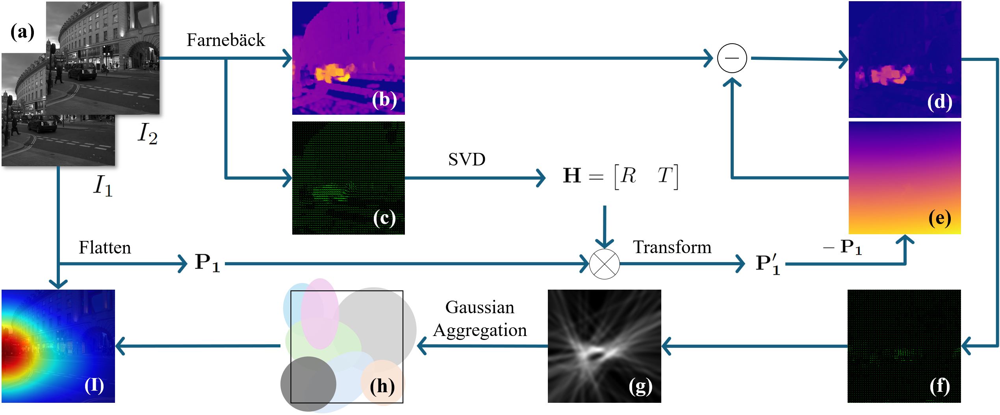

## Project Overview
Assistive visual navigation systems for visually impaired individuals have become increasingly popular thanks to the rise of mobile computing. Most of these devices work by translating visual information into voice commands. In complex scenarios where multiple objects are present, it is imperative to prioritize object detection and provide immediate notifications for key entities in specific directions. This brings the need for identifying the observer’s motion direction (ego-motion) by merely processing visual information, which is the key contribution of this project.
<a href="https://arxiv.org/pdf/2404.17031" target="_blank">Paper</a>

<br> 
See our poster at the BSN 2024: 
<a href="../files/MotorFocus_poster_2.pdf" target="_blank">BSN 2024 Poster</a>

<br>
See our project page for the practical implementation and testing:
<a href="https://github.com/AIS-Clemson/VisionGPT" target="_blank">AIS-Clemson/VisionGPT</a>
<a href="https://github.com/JiayouQin/H-Splitter/tree/main" target="_blank">AIS-Clemson/MotorFocus</a>


# (2025) VIA-LLM: Visually Impaired Assistive Tool with LLM Reasoning (under developing) 
Globally, over two billion people suffer from vision impairment, with approximately 43 million classified as legally blind \cite{who_blindness}. Some eye diseases, such as Retinitis Pigmentosa (RP), lead to gradual vision loss and currently have no cure. Most treatments for such genetics-driven diseases – including gene therapy (e.g., Luxturna for specific mutations), stem cells, artificial retinal implants, and vitamin A supplementation – have shown only minor effects in restoring lost vision and remain in exploratory stages for decades. For such conditions, developing assistive tools arises as a promising alternative to enable patients to manage their daily tasks and live more independently. 


## Computer Vision
To assist visually impaired users in perceiving their surroundings, we integrate real-time computer vision capabilities. Our system captures live video from a user-worn camera and processes the stream to identify objects, detect motion patterns, and simulate various vision impairment conditions. These capabilities form the foundation for further semantic reasoning and audio-based feedback generation.


### Object detection/segmentation
We apply state-of-the-art object detection and segmentation models YOLO to identify and localize important entities within the user's environment. These include dynamic obstacles (e.g., vehicles, people) and static infrastructure (e.g., staircases, signboards). The detected objects are then analyzed for spatial layout, proximity, and potential interaction, enabling context-aware guidance and warnings.

<div align="center">
    
</div>

### Motion-based analysis
In complex, dynamic scenes, recognizing motion is critical for timely intervention. Our system tracks moving objects and analyzes their trajectories to predict potential collisions or abnormal behaviors (e.g., a person running against the flow). This allows the agent to prioritize hazards and issue real-time alerts, even in crowded urban settings.

<div align="center">
    
</div>

### Simulated visual impairment-sensing
"Less is better." To understand the visual limitations of different eye diseases, we simulate vision loss scenarios such as tunnel vision, blurred vision, or night blindness. These simulations help us evaluate the system's effectiveness under various impairment models and guide the design of compensation strategies such as auditory cues or zoomed-in focus detection.

<div align="center">
    
</div>


## Assistive agent
Beyond perception, VIA-LLM incorporates reasoning and interaction modules that bridge the gap between raw visual data and meaningful user feedback. Using large language models, the system can interpret scene context, anticipate risks, and generate natural-language responses for real-time assistance.


### Early detection & feedback
The system continuously monitors the scene to detect potentially hazardous situations in advance—such as a fast-approaching vehicle or an unexpected object on the path. It prioritizes urgency and relevance, enabling timely and intuitive feedback to the user through auditory signals or haptic cues.

<div align="center">
    
</div>


### Voice boardcast & alert
To maximize accessibility, our system employs a voice-based interface to broadcast situational awareness updates and urgent alerts. For example, it can announce, “Crosswalk ahead, wait for green light,” or “Bicycle approaching from the left.” This interactive voice feedback, powered by LLM-driven semantic analysis, ensures that users are not overwhelmed by raw data but instead receive concise, contextually relevant guidance.


<div align="center">
    
</div>


# (2024) Ego-Motion Prediction with All-Pixel Matching 
This project introduces Motor Focus -- a lightweight, image-based framework designed to predict ego-motion, i.e., the movement intentions of humans (or humanoid machines), using visual input while filtering out camera motion without the need for camera calibration. The framework implements an optical flow-based pixel-wise temporal analysis to account for camera movement, enhanced by a Gaussian aggregation to smooth the predicted movement area.

<div align="center">
    
</div>


## Features
Our framework mainly predicts ego-motion by identifying how users physically orient themselves in space through pixel-wise temporal analysis. 

- **Video Stabilization**: To counteract camera shake, we used SVD and optical flow to estimate the affine transformation matrix from feature points extracted in two consecutive frames.
- **Camera Motion Compensation**: The fusion of two consecutive frames filters the camera motion, which highlights the object that moves relatively with the observer.

<div align="center">
    
</div>


### Acknowledgements:

Please cite our work if you find this project helpful.
```bibtex
@inproceedings{wang2024motor,
  title={Motor Focus: Fast Ego-Motion Prediction for Assistive Visual Navigation},
  author={Wang, Hao and Qin, Jiayou and Chen, Xiwen and Bastola, Ashish and Suchanek, John and Gong, Zihao and Razi, Abolfazl},
  booktitle={2024 IEEE 20th International Conference on Body Sensor Networks (BSN)},
  pages={1--4},
  year={2024},
  organization={IEEE}
}
```


<br>
<br>
<br>


# (2024) VisionGPT: LLM-Assisted Real-Time Anomaly Detection for Safe Visual Navigation

## Use
Copy/Download the repository, replace the API key in OPENAI_API_KEY.yaml, and run the demo.py.


## Demonstration
<div align="center">
    
</div>

See our another project for the movement prediction: <a href="https://github.com/JiayouQin/H-Splitter" target="_blank">H-Splitter</a>


## Overview
This project explores the potential of Large Language Models(LLMs) in zero-shot anomaly detection for safe visual navigation. 

<br>

With the assistance of state-of-the-art real-time open-world
object detection model Yolo-World and specialized prompts, the proposed framework can identify anomalies within camera-captured frames that include any possible obstacles, then generate
concise, audio-delivered descriptions emphasizing abnormalities, assist in safe visual navigation
in complex circumstances. 


<div align="center">
    
</div>

Moreover, our proposed framework leverages the advantages of LLMs
and the open-vocabulary object detection model to achieve the dynamic scenario switch, which
allows users to transition smoothly from scene to scene, which addresses the limitation of traditional
visual navigation. 

Furthermore, this project explored the performance contribution of different prompt
components provided the vision for future improvement in visual accessibility and paved the way
for LLMs in video anomaly detection and vision-language understanding.


## Method

### Yolo-World
We apply the latest Yolo-world for the open-world object detection task to adapt the system in any scenario any situation. The detection classes are generated by GPT-4 and can be replaced dynamically.

<div align="center">
    
</div>

### GPT-3.5
We apply GPT-3.5 for fast response and low cost. We have tested GPT-4 and GPT-4V but found them not financial-friendly.

<div align="center">
    
</div>


### H-splitter
We implemented an H-splitter to assist object detection and categorize the objects into 3 different types based on the priority. 

<div align="center">
    
</div>

See our another project for more info: <a href="https://github.com/JiayouQin/H-Splitter" target="_blank">H-Splitter</a>


## Experiments
We use Yolo-World with the H-splitter for universal object detection. For any object that falls (a)in Area 3 or (b)in Area 1/2 with 15% of window size, we record the corresponding frame as anomalies. We set this Yolo-World-H setting as the ground truth for the benchmark.

### System Sensitivity
We pre-set the system with 3 different sensitivities to report the emergency: low, normal, and high. We find that the low system sensitivity is good for daily use due to the low false alarm rate.

<div align="center">
    
</div>

### Detection accuracy
We compare the VisionGPT with low system sensitivity with the ground truth to evaluate its performance. We find that VisionGPT has high Accuracy and prefers less False Positive (unnecessary reports).

<div align="center">
    
</div>

### System Performance & Compatibility
<div align="center">
    
</div>

### Cost Evaluation
<div align="center">
    
</div>


### Acknowledgements:

Please cite our work if you find this project helpful.
```bibtex
@article{wang2024visiongpt,
  title={VisionGPT: LLM-Assisted Real-Time Anomaly Detection for Safe Visual Navigation},
  author={Wang, Hao and Qin, Jiayou and Bastola, Ashish and Chen, Xiwen and Suchanek, John and Gong, Zihao and Razi, Abolfazl},
  journal={arXiv preprint arXiv:2403.12415},
  year={2024}
}
```


# Outcomes

## Conference Proceedings:
  -  Motor Focus: Fast Ego-Motion Prediction for Assistive Visual Navigation (BSN 2024)


# Codes
[VisionGPT](https://github.com/AIS-Clemson/VisionGPT)
<br>
[Motor Focus](https://github.com/JiayouQin/H-Splitter/tree/main)


# Project Team
## PI: Dr. Abolfazl Razi [arazi@clemson.edu](mailto:arazi@clemson.edu)

## Graduate Students:
-	Hao Wang
- Xiwen Chen
-	Ashish Bastola

## Undergraduate Students:
-	John Suchanek


## Acknowledgements:
-	Jiayou Qin (Stevens Institute of Technology)
-	Zihao Gong (Tokai University)

<br>
<br>
<br>

