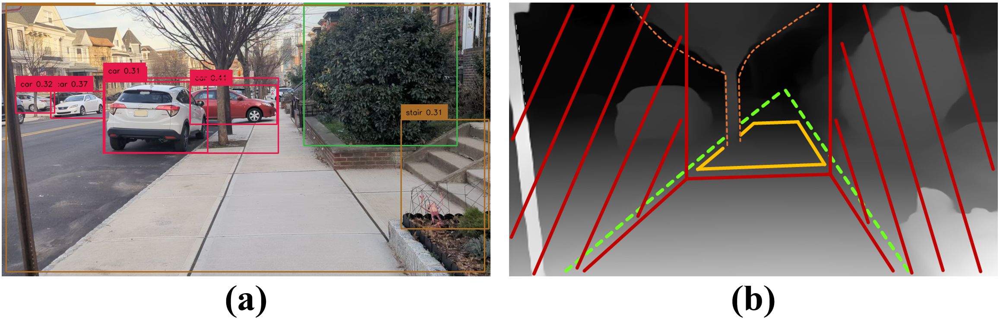
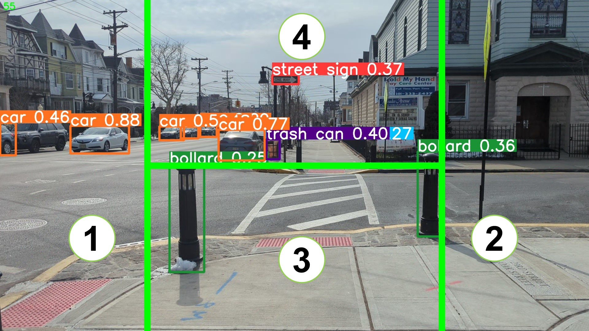

## PI: Dr. Abolfazl Razi [[arazi@clemson.edu](mailto:arazi@clemson.edu)]
**AI-SENDS Lab — School of Computing, Clemson University**  
*In collaboration with University of South Carolina & USC Beaufort*

---

## 1. Mission & Vision
Independent mobility remains one of the most critical challenges facing over 43 million individuals worldwide who are legally blind. While traditional white canes and guide dogs provide indispensable immediate physical detection, active individuals encounter severe safety bottlenecks during dynamic locomotion (e.g., brisk walking, running, and navigating unfamiliar urban corridors). 

The mission of this research initiative is to develop **closed-loop, edge-deployable assistive navigation architectures** that bridge the gap between high-rate physical biomechanics and semantic spatial reasoning. By unifying body-worn inertial dynamics, high-speed ego-motion filtering, and depth-conditioned multimodal foundation models, our systems translate rich visual environments into low-latency, intuitive directional guidance without relying on cloud computation.

<div align="center">
    <!-- Place your primary field video or main system demo here -->
    
</div>

<br>

<div align="center">
  <a href="https://github.com/AIS-Clemson/VisionGPT" target="_blank" style="margin: 0 10px; font-weight: bold;">[Code: VisionGPT]</a> •
  <a href="https://github.com/JiayouQin/H-Splitter/tree/main" target="_blank" style="margin: 0 10px; font-weight: bold;">[Code: Motor Focus]</a> •
  <a href="https://huggingface.co/datasets/Kevius/sanpo_annotations" target="_blank" style="margin: 0 10px; font-weight: bold;">[Dataset: Sanpo-D]</a> •
  <a href="https://ieeexplore.ieee.org/abstract/document/10780583" target="_blank" style="margin: 0 10px; font-weight: bold;">[BSN'24 IEEE Xplore]</a>
</div>

---

## 2. Interactive System Demonstrations

<table style="width: 100%; border: none; text-align: center;">
  <tr>
    <td style="width: 33%; vertical-align: top; padding: 10px;">
      
      <p><strong>Open-World Tracking</strong><br><small>Zero-shot obstacle detection and spatial layout parsing via localized YOLO backbones.</small></p>
    </td>
    <td style="width: 33%; vertical-align: top; padding: 10px;">
      
      <p><strong>Ego-Motion Compensation</strong><br><small>All-pixel SVD matching filtering camera jitter and heading drift at &gt;40 FPS.</small></p>
    </td>
    <td style="width: 33%; vertical-align: top; padding: 10px;">
      
      <p><strong>Acoustic Spatial Feedback</strong><br><small>Cadence-coupled auditory cues and high-priority hazard alerts under 60 ms latency.</small></p>
    </td>
  </tr>
</table>

---

## 3. Core Research Pillars

### Pillar A: Cadence-Adaptive Closed-Loop Guidance
Conventional electronic travel aids rely on fixed controller parameters optimized for a single walking speed, causing severe latency and oscillatory "Z-walk" overcorrections when users accelerate. 
* **Gait Rhythm Coupling:** By capturing real-time device motion at 100 Hz from a torso/waist-mounted sensor, our controller estimates cadence without requiring user-specific stride calibration.
* **Dynamic Control Law:** An affine adaptation law continuously adjusts look-ahead preview horizons, temporal smoothing, and derivative damping in real time.
* **Empirical Validation:** In controlled locomotion trials, cadence-adaptive control reduced corrective cue reversals by **71%** ($p=0.001$), decreased correction latency by **52%**, and suppressed large guideline departures by **48%** while maintaining a steady 24 FPS throughput.

<div align="center">
    
</div>

### Pillar B: Edge-Computed Spatial Reasoning & Depth Prior Fusion
Large vision-language models (VLMs) frequently suffer from hallucination and temporal drift across long-horizon egocentric videos.
* **Metric Depth Conditioning:** We integrate Depth Anything 3 (DA3) metric depth maps directly into RGB streams, injecting geometric inductive bias without altering underlying model weights.
* **Compact Model Generalization:** Benchmarks demonstrate that compact 0.5B–2B parameter models (e.g., InternVL2-2B, SmolVLM2) generalize more effectively to spatial obstruction detection than ungrounded 7B/8B counterparts, enabling full on-device execution.
* **Impairment Simulation:** To ensure clinical relevance, perception algorithms are evaluated under simulated visual pathologies, including retinitis pigmentosa (tunnel vision), macular degeneration, and cataract scatter.

<div align="center">
    
</div>

### Pillar C: All-Pixel Ego-Motion & Hazard Prioritization
Body-worn and handheld cameras suffer from extreme high-frequency shaking that degrades conventional visual odometry.
* **Calibration-Free Ego-Motion Compensation:** Rather than relying on computationally heavy sparse keypoint matching (SIFT/ORB), our approach treats every pixel as a flow vector and solves rigid frame transformations using closed-form Singular Value Decomposition (SVD) in under 1 ms.
* **Spatial H-Partitioning:** Frames are dynamically segmented into four functional safety zones (Ground, Front, Left, Right) to differentiate between background clutter and actionable hazards requiring immediate deceleration.
* **Edge Hardware Benchmarking:** The end-to-end perception pipeline achieves 51–61 ms inference on mobile neural engines (Apple A16/M2 architectures).

<div align="center">
    
</div>

---

## 4. Benchmark Datasets & Resources

We contribute open datasets and evaluation protocols to advance embodied AI for assistive mobility:

* **VIN-Bench (Visual Assistive Navigation Benchmark):**  
  A large-scale multimodal corpus comprising **10,046 event-anchored clips across 70 sessions (>50 hours)**. Synchronizes dual-view egocentric RGB (head-mounted POV vs. chest-mounted primary), 100 Hz IMU, LiDAR depth, and GPS trajectories with sub-100 ms cross-device acoustic alignment. Supports standardized evaluation of Vision-Language-Action (VLA) trajectory planning and safety reasoning.
* **Sanpo-D Spatial VQA Dataset:**  
  A navigation-oriented spatial re-annotation of the Google Sanpo dataset, featuring 647 fine-grained multimodal QA pairs probing pedestrian proximity, lateral obstructions, intersection layouts, and path affordances under long-horizon drift.  
  👉 **Dataset Access:** [Hugging Face Sanpo-D Repository](https://huggingface.co/datasets/Kevius/sanpo_annotations)
* **Urban Cruising & Motor Focus Corpus:**  
  Real-world first-person walking, biking, and scooter recordings annotated for frame-by-frame motor focus intention and ego-motion compensation.  
  👉 **Dataset Access:** [Google Drive Archive](https://drive.google.com/drive/folders/1HPEWBdEk4aKgus1h37ZkU2KJ964DxmwA?usp=sharing)

---

## 5. Peer-Reviewed Publications

* **Cadence-Adaptive Control for Camera-Based Assistive-Running Guidance**  
  Si-En Hong, Hao Wang, Abolfazl Razi  
  *IEEE International Conference on Wearable and Implantable Body Sensor Networks (BSN)*, 2026.  
  `[Accepted]`

* **Spatial-Conditioned Reasoning in Long-Horizon Egocentric Videos**  
  James Tribble, Si-En Hong, Hao Wang, Chaoyi Zhou, Ashish Bastola, Siyu Huang, Abolfazl Razi  
  *IEEE International Conference on Wearable and Implantable Body Sensor Networks (BSN)*, 2026.  
  `[Accepted]` • [Dataset (HuggingFace)](https://huggingface.co/datasets/Kevius/sanpo_annotations)

* **Motion Focus Recognition in Fast-Moving Egocentric Video**  
  Si-En Hong, James Tribble, Alexander Lake, Hao Wang, Chaoyi Zhou, Ashish Bastola, Siyu Huang, Eisa Chaudhary, Brian Canada, Ismahan Arslan-Ari, Abolfazl Razi  
  *IEEE/CVF Winter Conference on Applications of Computer Vision Workshops (WACVw @ CV4WS)*, 2026.  
  [arXiv:2601.07154](https://arxiv.org/abs/2601.07154)

* **VIN-Bench: Benchmarking Safety Reasoning and Action Planning for Visual Assistive Navigation**  
  *IEEE/CVF Winter Conference on Applications of Computer Vision (WACV)*, 2027 Datasets Track.  
  `[Under Review]`

* **Motor Focus: Fast Ego-Motion Prediction for Assistive Visual Navigation**  
  Hao Wang, Jiayou Qin, Xiwen Chen, Ashish Bastola, John Suchanek, Zihao Gong, Abolfazl Razi  
  *IEEE 20th International Conference on Body Sensor Networks (BSN)*, 2024.  
  [DOI: 10.1109/BSN63547.2024.10780583](https://ieeexplore.ieee.org/abstract/document/10780583) • [Poster](../files/MotorFocus_poster_2.pdf)

* **VisionGPT: LLM-Assisted Real-Time Anomaly Detection for Safe Visual Navigation**  
  Hao Wang, Jiayou Qin, Ashish Bastola, Xiwen Chen, John Suchanek, Zihao Gong, Abolfazl Razi  
  *arXiv preprint arXiv:2403.12415*, 2024.  
  [arXiv:2403.12415](https://arxiv.org/abs/2403.12415) • `50+ Citations`

```bibtex
@inproceedings{hong2026cadence,
  title={Cadence-Adaptive Control for Camera-Based Assistive-Running Guidance},
  author={Hong, Si-En and Wang, Hao and Razi, Abolfazl},
  booktitle={IEEE International Conference on Wearable and Implantable Body Sensor Networks (BSN)},
  year={2026}
}

@inproceedings{tribble2026spatial,
  title={Spatial-Conditioned Reasoning in Long-Horizon Egocentric Videos},
  author={Tribble, James and Hong, Si-En and Wang, Hao and Zhou, Chaoyi and Bastola, Ashish and Huang, Siyu and Razi, Abolfazl},
  booktitle={IEEE International Conference on Wearable and Implantable Body Sensor Networks (BSN)},
  year={2026}
}

@inproceedings{wang2024motor,
  title={Motor Focus: Fast Ego-Motion Prediction for Assistive Visual Navigation},
  author={Wang, Hao and Qin, Jiayou and Chen, Xiwen and Bastola, Ashish and Suchanek, John and Gong, Zihao and Razi, Abolfazl},
  booktitle={2024 IEEE 20th International Conference on Body Sensor Networks (BSN)},
  pages={1--4},
  year={2024},
  organization={IEEE}
}
