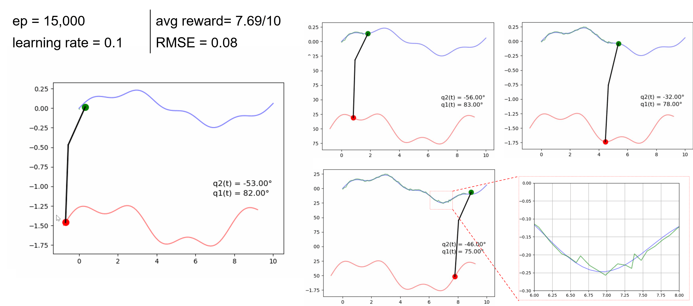
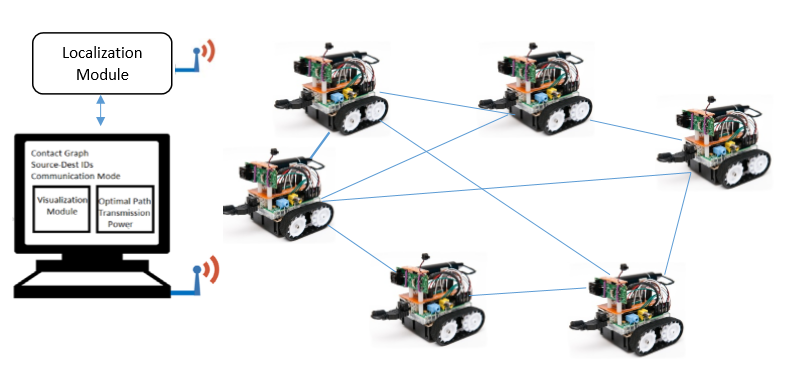
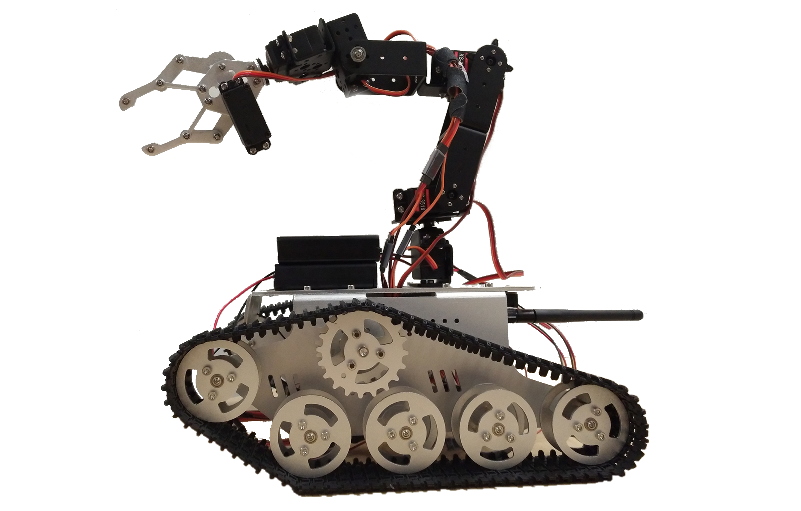

 

# Project Synopsis

This project aims to implement an inverse learning framework for Autonomous Vehicles (AVs) for motion-based anomaly detection by modeling and discovering the target decision-making process. We consider the mobility of AVs as a key example of AI-based action planning and aim to identify suspicious activities taken by intruding nodes, as part of NSF Project Number #2204721.

We made some initial tests on extending the trajectory planning for actuator UAVs that include overhead manipulators. The goal is to develop RL algorithms to achieve a desired tip trajectory for a given base trajectory.

 
Preliminary results can be found in [this paper presented in SwarmNet 2023 Workshop](https://arxiv.org/pdf/2308.12843.pdf)
 
 

## Research Task 7: Anomaly Detection and Safety Monitoring
The ultimate goal of this project is Anomaly Detection, or identifying Agents' actions that are not fully aligned with the expected rational behavior obtained by Inverse Learning.  This Aspect includes (i) developing a reverse engineering framework that monitors the environment and target's actions to discover its decision-making strategy, as a baseline, and (ii)  identifying deviations from predicted behavior. The challenges include projecting the observer's perception of the environment to the target's perspective (seeing the world from the target's eyes), determining the target's ultimate goal and reward-generation process (reading the agent's brain), and including potentially unknown factors in the decision-making strategy. To this end, we develop a set of Network-Level Safety Metrics (NSM) to gauge the overall safety of traffic highways with mixt traffic of regular and self-driving vehicles. 

 

For more information, please read this [article](https://ieeexplore.ieee.org/stamp/stamp.jsp?arnumber=9954361)
 
 

## Undergraduate Research
TBD

 
 
 

# Project Team
## PI: Dr. Abolfazl Razi [arazi@clemson.edu](mailto:arazi@clemson.edu)

## Graduate Students:
- Hazim Alzorgan

## Undergraduate Students:
-	TBD
  

 
 
 

# Outcomes
The following papers are the outcome of completing this project. 

  
  -  Alzorgan, Hazim, Abolfazl Razi, and Ata Jahangir Moshayedi. "Actuator trajectory planning for uavs with overhead manipulator using reinforcement learning." 2023 IEEE 34th Annual International Symposium on Personal, Indoor and Mobile Radio Communications (PIMRC). IEEE, 2023.
  -  Alzorgan, Hazim, and Abolfazl Razi. "Monte Carlo Beam Search for Actor-Critic Reinforcement Learning in Continuous Control." arXiv preprint arXiv:2505.09029 (2025).

 
 
 

<!--
# Training Opportunities
TBD his project provides content for CPSC 4820/6820 titled "AI for Autonomous Vehicles", especially developing several hands-on projects, training modules, and simulation scenarios in virtual environments (SUMO, Webots, Carla).
Here is the [CPSC4820/6820 syllabus](../files/CPSC4820S23Syllabus.pdf).

# Capstone Projects
[EduPlatCommPro-S19. The Educational Platform for Communication Protocols](https://ceias.nau.edu/capstone/projects/EE/2019/EduPlatCommPro-S19/)
 
Team Members: Christopher Thompson, Tyler Halperin, Tyler Criss, Huayu Li
 

[Ground Robotic Design for Predictive Communications](https://ceias.nau.edu/capstone/projects/EE/2018/OrdnanceDisposal1/))
 
Team Members: Fahad Almaraghi, Yuting Zhang, Qiyuan Huang, Chaoju Wang, Hanxiao Lu

 
 

[Explosive Ordnance Disposal Robot Design](https://ceias.nau.edu/capstone/projects/EE/2018/OrdnanceDisposal2/home.html)
 
Team Members: Cody Warner, Sixian Zhang, Yazhou Li, Zening Wen, Huiwen Chu

 
 
 

# Codes

[Network Level Safety Metrics](https://github.com/XiwenChen-Clemson/Network-level-safety-metrics)
 
[Subband Pyramid Network: A new Attention Mechanism for DL](https://github.com/HuayuLiNAU/Subband-Pyramid-Network)

 
 
 

# Broader Impacts
This project will produce new methods, algorithms, tools, software packages, and product prototypes usable by the CISE research community. This project is expected to advance the frontier of knowledge in the intersection of AI and wireless networking by developing learning algorithms for networking protocols. Our plan will impact the US economy by reducing the networking cost by lubricating the information flow machinery by incorporating the perception of the surrounding environment into networking protocols. The developed knowledge will be incorporated as project topics into related courses in both networking and AI fields taught by the PI and other faculty that impact the large population of female and underrepresented students, especially from Native American and Hispanic origins at NAU. The PI’s several years of industrial experience will help him to translate the developed technology into proof-of-concept products, demos, and patents. The PI plans to apply for the supplement NSF REU grant to translate the research results into projects appropriate for undergraduate students.
-->

 
 
