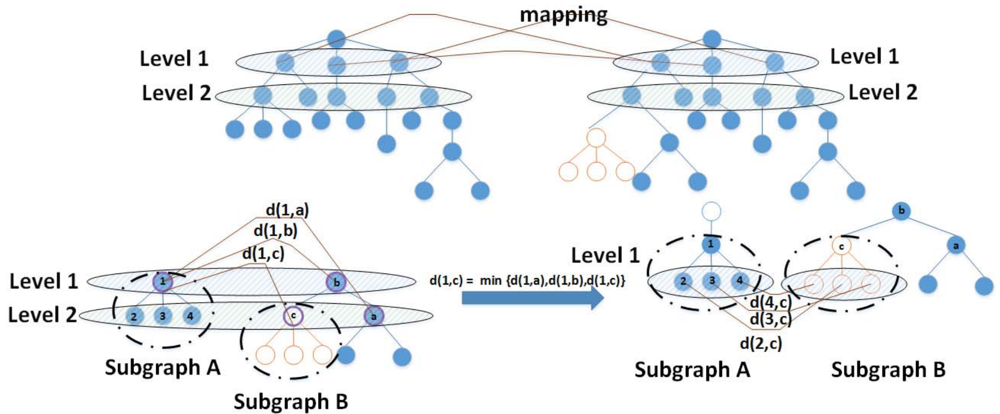
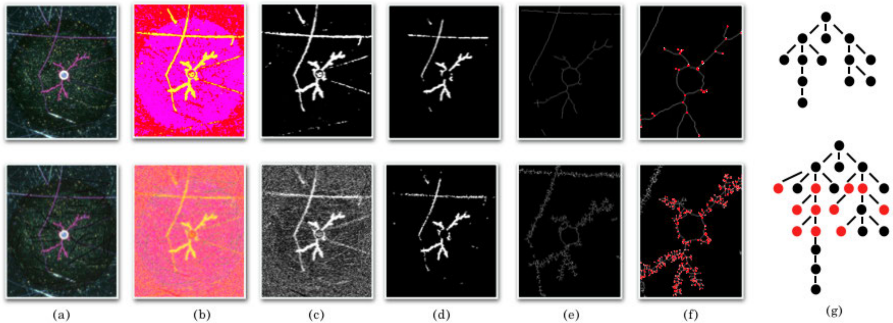
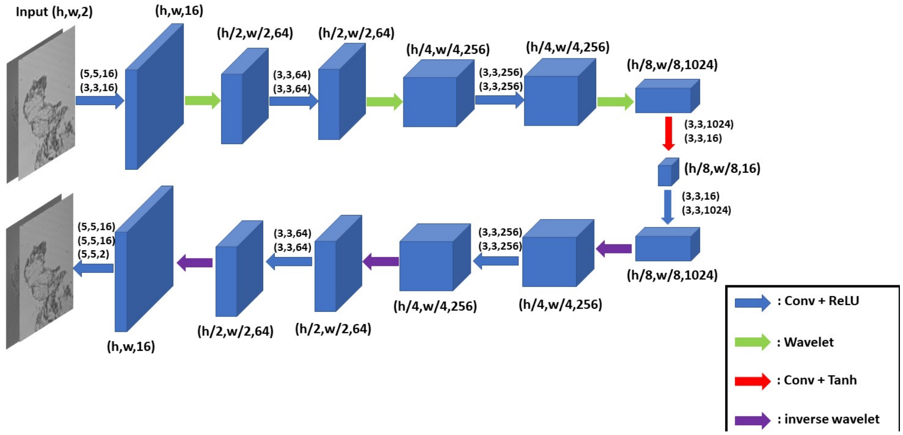
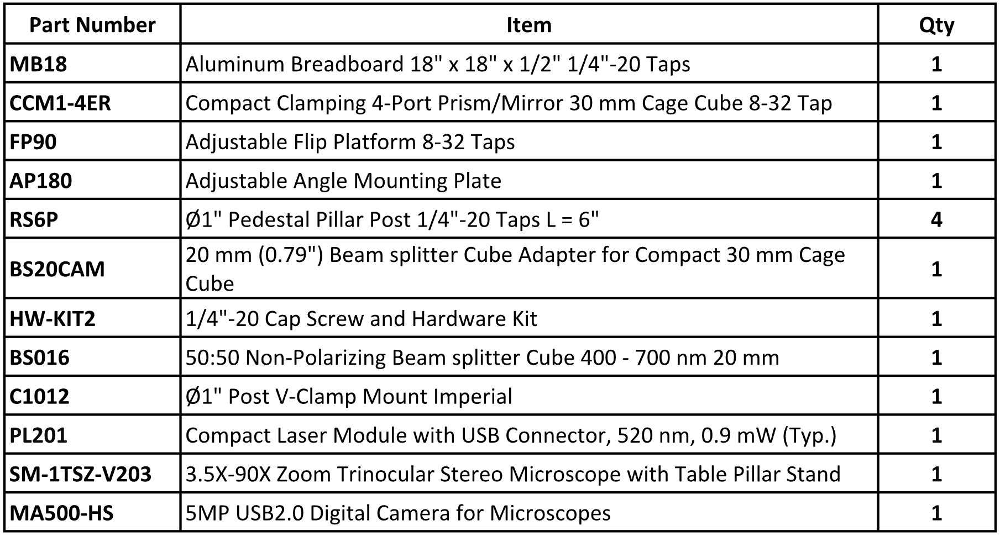

# Project Overview

We present a solution for secure monitoring in supply chains with nano-resolution visual identifiers-based cyber-physical systems.
In this project, nano-reoslution samples are used for identification and authentication process. 

The dendritic samples are electro-chemical generated nano-materials and is customizable in terms of scale and morphology complexity. 

Compare to the conventional barcode or QR code-based methods, our solution provide high-level security due to the randomness and high entropy information of dendritic samples. Meanwhile, our computer vision-based algorithm provides a competitive computation cost.

    

## Subproject #1: Top-Down Graph Matching Algorithm 

Demonstration of the proposed algorithm to find similarity between the test graph and a set of reference graphs. Top row presents sub graph mapping stage. The bottom row, represents identification and recovery of level change by the proposed modified algorithm.

## Subproject #2: Ad-hoc Consistency Penalized Probabilistic Graph Matching 

The image processing steps applied to the reference dendrite (top row) and the noisy version of the test dendrite (bottom row). The columns represent: (a) the original image, (b) the Image in YCbCr space, (c) the image after segmentation, (d) the binarized image, (e) the extracted and thinned skeleton, (f) the extracted graph vertices (feature points), and (g) the representative graph.

## Subproject #3: Autoencoders with deep Prior for 3D Image Reconstruction  

For the deep convolutional autoencoder with hourglass architecture used in this paper. We deploy Batch Normalization after each convolution layer except the last three layers to stabilize the training steps.

## Subproject #4: Transferrable Generative Models for 3D Image Reconstruction  

While the key points information can be extracted from the 2D images, richer information such as depth and phase can be retrival from another advanced optical photography method, which is Digital Holograph (DH). 

Digital Holograph is used to recover the phase information of samples. In order to generate the phase information, we apply Digital In-line Holography (DIH) to the real samples, and obtain the generated hologram from a regular CMOS. 

Through deep learning-based methods, the phase information can successfully been reconstructed from the hologram. 

## Subproject #5-1: Fast Key Points Detection and Matching

To extract the information from dendritic samples, we apply a sequence of feature extraction process that using spatial filters and frequency filters to obtain low-frequency information.

Then we apply our proposed fast key points extraction algorithm to get the feature points that can represent the original graph.

Specifically, we apply multiple sliding windows to traverse the graph and store the key points information. 

The implementation of multiple-sliding window can greatly boost the searching efficiency.

## Subproject #5-2: Nano CPS pilot Platform
Similar to the facial recognition, each dendritic pattern have a unique ID, and different patterns tend to have different location in feature space. This non-inverse process can accelerate the searching speed, while prevent the hard-decoding from external cyber-attacks.

To apply the implemented methods into the supply systems, we developed our cloud-based management interface, which can be accessed from multiple platforms such as mobile phone, tablet, and desktop.

To further integrate with supplyers and vendors, we initiated massive production according to the requirements of different products and delivery purposes. 

We are also working on the security improvement using adversarial learning methods to reduce the risks of cyber-attack from different dimensions. 

For the demonstration of this project, please see <a href="">this link</a>

## Subproject #6: Dendrite Simulator [In progress work]

    

# Lab Equipments

    

# Project Team
## PI: Dr. Abolfazl Razi [arazi@clemson.edu](mailto:arazi@clemson.edu)
- Chriss Mann
- Michael Kozicki

## Graduate Students:
- Xiwen Chen
-	Hao Wang
- Huayu Li (Graduated)
-	Ali Valehi (Graduated)
-	Jiaming Chen(Graduated)

    

# Related Works

Valehi, Ali, et al. "A graph matching algorithm for user authentication in data networks using image-based physical unclonable functions." 2017 Computing Conference. IEEE, 2017.

 

Chi, Zaoyi, et al. "Consistency penalized graph matching for image-based identification of dendritic patterns." IEEE Access 8 (2020): 118623-118637.

 

Li, Huayu, et al. "Deep DIH: Statistically inferred reconstruction of digital in-line holography by deep learning." arXiv preprint arXiv:2004.12231 (2020).

 

Chen, Xiwen, et al. "DH-GAN: a physics-driven untrained generative adversarial network for holographic imaging." Optics Express 31.6 (2023): 10114-10135.

 

Wang, Hao, et al. "Fast key points detection and matching for tree-structured images." 2022 International Conference on Computational Science and Computational Intelligence (CSCI). IEEE, 2022.

 

H. Wang, X. Chen, A. Razi, M. Kozicki, R. Amin and M. Manfredo, "Nano-Resolution Visual Identifiers Enable Secure Monitoring in Next-Generation Cyber-Physical Systems," 2022 International Conference on Computational Science and Computational Intelligence (CSCI), Las Vegas, NV, USA, 2022, pp. 856-861, doi: 10.1109/CSCI58124.2022.00155.
