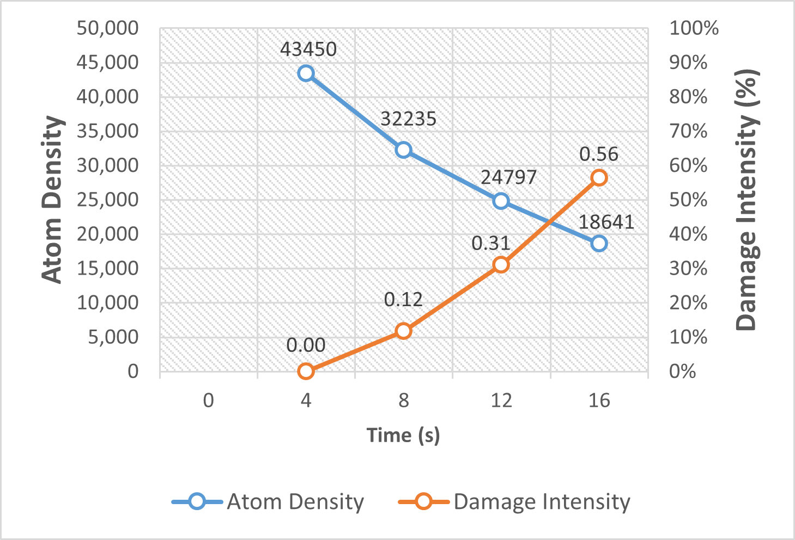
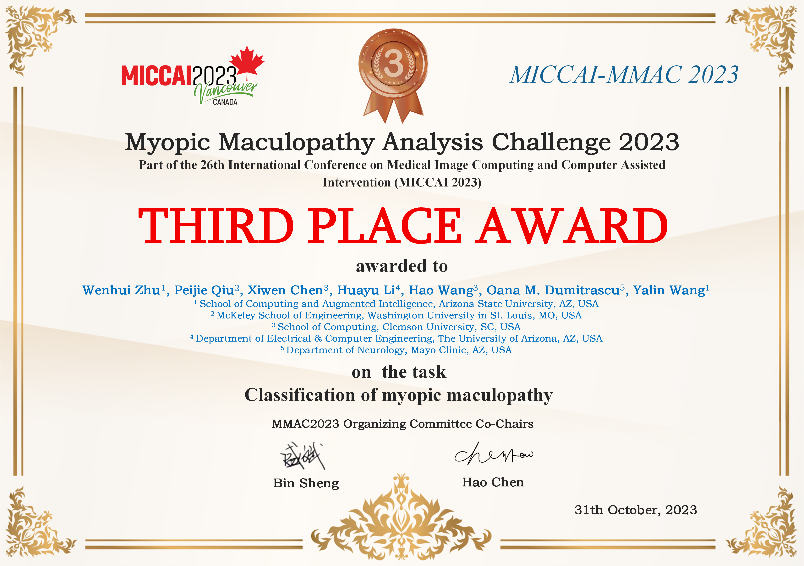

<!-- ## PI: Dr. Abolfazl Razi [arazi@clemson.edu](mailto:arazi@clemson.edu) -->

## Project Overview
Assistive visual navigation systems for visually impaired individuals have become increasingly popular thanks to the rise of mobile computing. Most of these devices work by translating visual information into voice commands. In complex scenarios where multiple objects are present, it is imperative to prioritize object detection and provide immediate notifications for key entities in specific directions. This brings the need for identifying the observer’s motion direction (ego-motion) by merely processing visual information, which is the key contribution of this project.

<br> 

<!-- See our poster/paper at the BSN 2024: 
<a href="../files/MotorFocus_poster_2.pdf" target="_blank">BSN 2024 Poster</a> 
/ 
<a href="https://ieeexplore.ieee.org/abstract/document/10780583" target="_blank">Paper</a>


See our project page for the practical implementation and testing:
<a href="https://github.com/JiayouQin/H-Splitter/tree/main" target="_blank">AIS-Clemson/MotorFocus</a>
 
<a href="https://github.com/AIS-Clemson/VisionGPT" target="_blank">AIS-Clemson/VisionGPT</a> -->


# (2025) Gaussian Differential Assessment of Sequential STEM Radiation Damage in Beam-Sensitive Materials

Electron beam-induced damage poses a major challenge to high-resolution imaging of beam-sensitive materials in transmission electron microscopy (TEM). To enable precise, quantitative assessment of radiation damage in sequential cryo-STEM imaging, we present a novel framework that integrates deep learning-based atomic localization with physics-informed Gaussian modeling. By leveraging a pre-trained U-Net from AtomSegNet, we extract atomic-column positions from HAADF-STEM image sequences of garnet-type Li₇La₃Zr₂O₁₂ (LLZO) solid electrolytes under cryogenic conditions. These atomic coordinates are converted into smoothed atomic density maps via Gaussian functions, allowing the computation of pixel-wise differential maps that capture fine-scale structural evolution across frames. Damage quantification is achieved through intensity-based analysis of these differential maps, revealing a linear correlation between atomic density loss and radiation exposure. Our method surpasses conventional CNN-based feature extraction approaches in spatial resolution and robustness to atomic drift, offering a reliable tool for precise, frame-by-frame quantification of beam-induced structural degradation in sensitive materials.

<div align="center">
    
</div>

<div align="center">
    
</div>

Our abstract is accepted by 
<a href="https://mmconference.microscopy.org/" target="_blank">Microscopy & Microanalysis 2025</a>
 


# (2025) Diffusion Prism: Enhancing Diversity and Morphology Consistency in Mask-to-Image Diffusion

The emergence of generative AI and controllable diffusion has made image-to-image synthesis increasingly practical and efficient. However, when input images exhibit low entropy and sparsity, the inherent characteristics of diffusion models often result in limited diversity. This constraint significantly interferes with data augmentation in many fields. To address this, we propose Diffusion Prism, a training-free framework that efficiently transforms binary masks into realistic and diverse samples while preserving morphological features. We explored that a small amount of artificial noise will significantly assist the imagedenoising process. To prove this novel mask-to-image concept, we use nano-dendritic patterns as an example to demonstrate the merit of our method compared to existing controllable diffusion models. Furthermore, we extend the proposed framework to other biological patterns, highlighting its potential applications across various fields. 

Our source code and sample datasets are available at: <a href="https://github.com/AIS-Clemson/diffusion_prism" target="_blank">https://github.com/AIS-Clemson/diffusion_prism</a>

<div align="center">
    
</div>

<div align="center">
    
</div>

<div align="center">
    
</div>

<div align="center">
    
</div>

<div align="center">
    
</div>

Our paper is accepted by 
<a href="https://wacv2025.thecvf.com/" target="_blank">WACV 2025 Workshop</a>
 

### Acknowledgements:
Please cite our work if you find this project helpful.
```bibtex
@InProceedings{Wang_2025_WACV,
    author    = {Wang, Hao and Chen, Xiwen and Bastola, Ashish and Qin, Jiayou and Razi, Abolfazl},
    title     = {Diffusion Prism: Enhancing Diversity and Morphology Consistency in Mask-to-Image Diffusion},
    booktitle = {Proceedings of the Winter Conference on Applications of Computer Vision (WACV) Workshops},
    month     = {February},
    year      = {2025},
    pages     = {228-237}
}
```

<br>
<br>
<br>


# (2024) RBAD: A Dataset and Benchmark for Retinal Vessels Branching Angle Detection

Detecting retinal image analysis, particularly the geometrical features of branching points, plays an essential role in diagnosing eye diseases. However, existing methods used for this purpose often are coarse-level and lack fine-grained analysis for efficient annotation. To mitigate these issues, this paper proposes a novel method for detecting retinal branching angles using a self-configured image processing technique. Additionally, we offer an open-source annotation tool and a benchmark dataset comprising 40 images annotated with retinal branching angles. Our methodology for retinal branching angle detection and calculation is detailed, followed by a benchmark analysis comparing our method with previous approaches. The results indicate that our method is robust under various conditions with high accuracy and efficiency, which offers a valuable instrument for ophthalmic research and clinical applications. 

The dataset and source codes are available at <a href="https://github.com/Retinal-Research/RBAD" target="_blank">https://github.com/Retinal-Research/RBAD</a>

<div align="center">
    
</div>

<div align="center">
    
</div>

<div align="center">
    
</div>

<div align="center">
    
</div>


Our paper is accepted by 
<a href="https://bhi.embs.org/2024/" target="_blank">IEEE EMBS BHI 2024</a>


### Acknowledgements:
Please cite our work if you find this project helpful.
```bibtex
@INPROCEEDINGS{10913865,
  author={Wang, Hao and Zhu, Wenhui and Qin, Jiayou and Li, Xin and Dumitrascu, Oana and Chen, Xiwen and Qiu, Peijie and Razi, Abolfazl and Wang, Yalin},
  booktitle={2024 IEEE EMBS International Conference on Biomedical and Health Informatics (BHI)}, 
  title={RBAD: A Dataset and Benchmark for Retinal Vessels Branching Angle Detection}, 
  year={2024},
  volume={},
  number={},
  pages={1-8},
  doi={10.1109/BHI62660.2024.10913865}}
```

<br>
<br>
<br>


# (2024) Many-MobileNet: Multi-Model Augmentation for Robust Retinal Disease Classification

In this work, we propose Many-MobileNet, an efficient model fusion strategy for retinal disease classification using lightweight CNN architecture. Our method addresses key challenges such as overfitting
and limited dataset variability by training multiple models with distinct data augmentation strategies
and different model complexities. Through this fusion technique, we achieved robust generalization
in data-scarce domains while balancing computational efficiency with feature extraction capabilities.

Our software package is available at <a href="https://github.com/Retinal-Research/NN-MOBILENET" target="_blank">https://github.com/Retinal-Research/NN-MOBILENET</a>

<div align="center">
    
</div>

<div align="center">
    
</div>

Our model fusion strategy secured 3rd place in MICCAI UWF4DR 2024 Challenge.

<div align="center">
    
</div>


### Acknowledgements:
Please cite our work if you find this project helpful.
```bibtex
@article{wang2024many,
  title={Many-MobileNet: Multi-Model Augmentation for Robust Retinal Disease Classification},
  author={Wang, Hao and Zhu, Wenhui and Dong, Xuanzhao and Chen, Yanxi and Li, Xin and Qiu, Peijie and Chen, Xiwen and Vasa, Vamsi Krishna and Xiong, Yujian and Dumitrascu, Oana M and others},
  journal={arXiv preprint arXiv:2412.02825},
  year={2024}
}
```

<br>
<br>
<br>


# (2023) Beyond MobileNet: An improved MobileNet for Retinal Diseases 

Myopic Maculopathy (MM) is the leading cause of severe vision loss or blindness. Deep learning-based automated tools are indispensable in assisting clinicians in diagnosing and monitoring RD in modern medicine. Recently, an increasing number of works in this field have taken advantage of Vision Transformer to achieve state-of-the-art performance with more parameters and higher model complexity compared to Convolutional Neural Networks (CNNs). Such sophisticated model designs, however, are prone to be overfitting and hinder their advantages in specific tasks in medical image analysis. In this work, we argue that a well-calibrated CNN model may mitigate these problems. To this end, we empirically investigated the macro and micro designs of a CNN and its training strategies by starting with a standard MobileNet. Based on the investigation, we proposed a lightweight MobileNet training framework equipped with a series of optimal parameters and modules based on retinal images.

Our software package is available at <a href="https://github.com/Retinal-Research/NN-MOBILENET" target="_blank">https://github.com/Retinal-Research/NN-MOBILENET</a>

<div align="center">
    
</div>

<div align="center">
    
</div>

Our model secured third place in the MICCAI MMAC 2023 Challenge - Classification of Myopic Maculopathy. 

<div align="center">
    
</div>


### Acknowledgements:
Please cite our work if you find this project helpful.
```bibtex
@inproceedings{zhu2023beyond,
  title={Beyond mobilenet: An improved mobilenet for retinal diseases},
  author={Zhu, Wenhui and Qiu, Peijie and Chen, Xiwen and Li, Huayu and Wang, Hao and Lepore, Natasha and Dumitrascu, Oana M and Wang, Yalin},
  booktitle={International Conference on Medical Image Computing and Computer-Assisted Intervention},
  pages={56--65},
  year={2023},
  organization={Springer}
}
```

<br>
<br>
<br>


# Project Team
## PI: Dr. Abolfazl Razi [arazi@clemson.edu](mailto:arazi@clemson.edu)

## Graduate Students:
-	Hao Wang
-   Xiwen Chen
-	Ashish Bastola

## Undergraduate Students:
-	John Suchanek

## Acknowledgements:
-   Wenhui Zhu (Arizona State University)
-	Jiayou Qin (Stevens Institute of Technology)
-	Zihao Gong (Tokai University)

<br>
<br>
<br>

