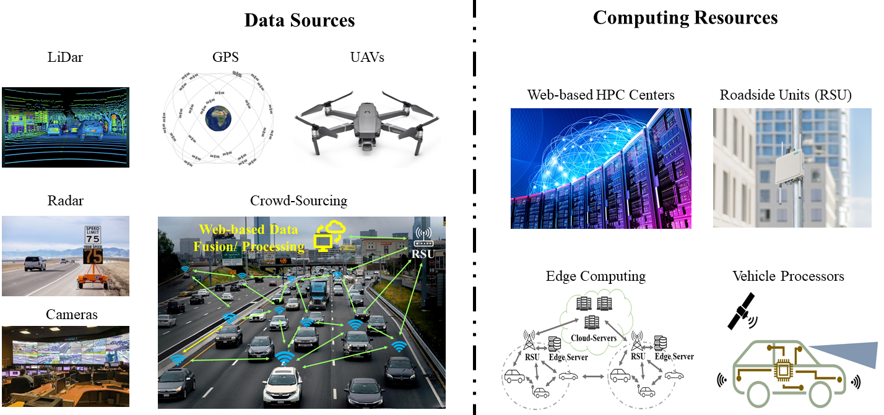
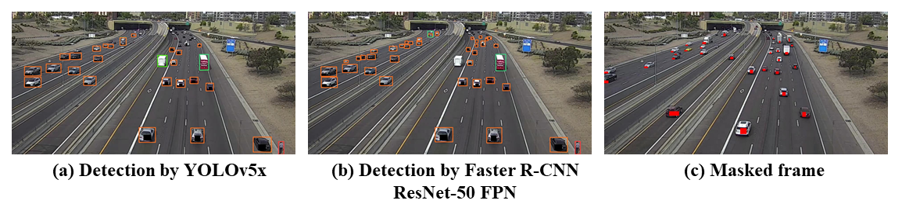
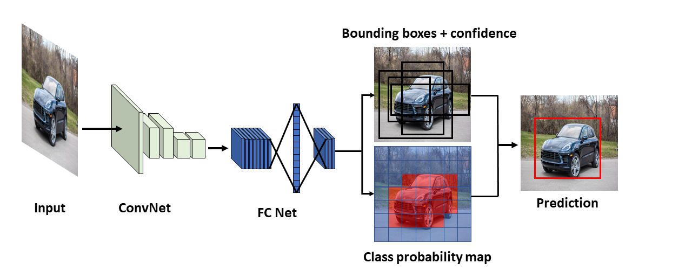
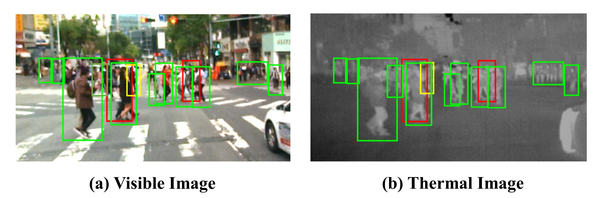
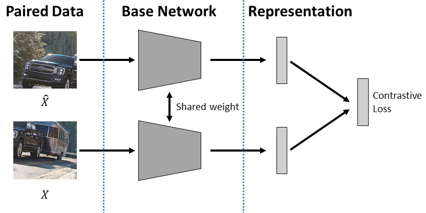
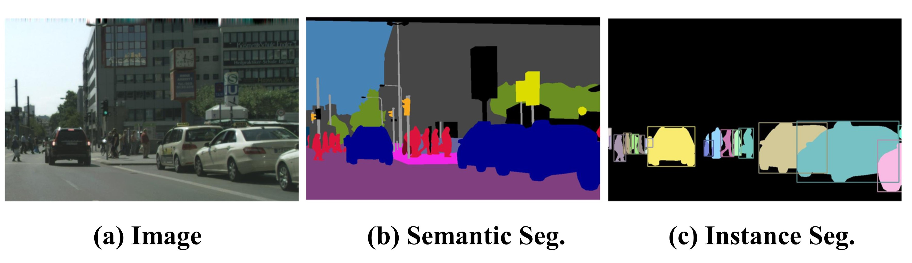
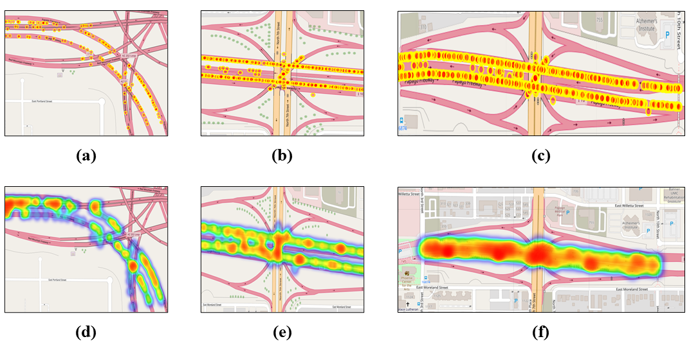
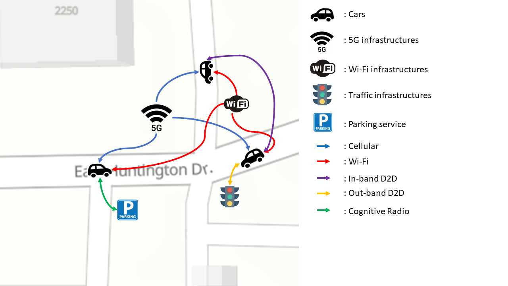

# Citation
Recommended citation: 

Razi A, Chen X, Li H, et al. Deep learning serves traffic safety analysis: A forward‐looking review[J]. IET Intelligent Transport Systems, 2022.

BibTeX:
@article{razi2022deep,
  title={Deep learning serves traffic safety analysis: A forward-looking review},
  author={Razi, Abolfazl and Chen, Xiwen and Li, Huayu and Wang, Hao and Russo, Brendan and Chen, Yan and Yu, Hongbin},
  journal={IET Intelligent Transport Systems},
  year={2022},
  publisher={Wiley Online Library}
}

[Download paper here](https://ietresearch.onlinelibrary.wiley.com/doi/epdf/10.1049/itr2.12257)

# Abstract
This paper explores deep learning (DL) methods that are used or have the potential to be used for traffic video analysis, emphasising driving safety for both autonomous vehicles and human-operated vehicles. A typical processing pipeline is presented, which can be used to understand and interpret traffic videos by extracting operational safety metrics and providing general hints and guidelines to improve traffic safety. This processing framework includes several steps, including video enhancement, video stabilisation, semantic and incident segmentation, object detection and classification, trajectory extraction, speed estimation, event analysis, modelling, and anomaly detection. The main goal is to guide traffic analysts to develop their own custom-built processing frameworks by selecting the best choices for each step and offering new designs for the lacking modules by providing a comparative analysis of the most successful conventional and DL-based algorithms proposed for each step. Existing open-source tools and public datasets that can help train DL models are also reviewed. To be more specific, exemplary traffic problems are reviewed and required steps are mentioned for each problem. Besides, connections to the closely related research areas of drivers' cognition evaluation, crowd-sourcing-based monitoring systems, edge computing in roadside infrastructures, automated driving systems-equipped vehicles are investigated, and the missing gaps are highlighted. Finally, commercial implementations of traffic monitoring systems, their future outlook, and open problems and remaining challenges for widespread use of such systems are reviewed.

# Introduction
Despite recent advances in vehicles' operational safety features, computer-assisted control, and technology-based traffic management systems, traffic safety remains one of the main challenges in today's life. Every year, traffic crashes account for 20–50 million causalities and 1.35 million fatalities worldwide, making it one of the top-10 causes of death. Indeed, traffic crashes is the leading cause of death for people aged 5 to 29.

Using computational intelligence and computer tools for enhancing traffic safety has gained a lot of attention in recent years. Mainstream technological trends include (i) implementing vehicle safety features such as forward collision warning, blind-spot detection, lane departure warning, backup camera, and autonomous emergency braking, (ii) simulation-based road infrastructure design such as Site3D, RoadEng, and OpenRoads Designer, and (iii) intelligent traffic flow management systems such as global positioning system (GPS)-based navigation tools. An example of the last category is Google's road-user interpretive software that can infer the common road behaviour of other drivers that allows engine control units (ECUs) to make better route decisions.

# Architectural View
Traffic safety analysis can be viewed as a modular and multi-faceted problem that involves many aspects. As shown below, the overall analysis platform can be viewed as a software pipeline where the collected information undergoes different processing steps until it is translated to navigation commands, advisory messages, or overall guidelines for improving traffic safety.

# Deep Learning Methods
The common core of vision-based driving safety analyses is using deep learning methods for image/video processing. We skip the details of DL methods here for the sake of brevity and refer the interested reader to previous reviews.

It is noteworthy that most of the recent developments in DL have been driven by two applications, computer vision (CV), and natural language processing (NLP), as two key representatives of visual and sequential processing problems. Most elegantly designed DL platforms utilise multilayer perceptron (MLP), convolutional neural networks (CNN), recurrent neural networks (RNN), and transformers as their building blocks. We will provide a more detailed analysis of custom-built DL methods used in the context of driving video analysis and safety control.

## DL-based Object Fetection Methods in Traffic Analysis
Object detection is another key stage in DL-based processing pipelines for driving safety analysis. Object detection simply means locating different objects in images and video frames, potentially with complex backgrounds, by drawing bounding boxes around the objects of interest. It can coexist or be integrated with object classification and labelling. An illustrative example of vehicle detection using two benchmark methods is shown in below.

## YOLO
One-stage detectors directly treat object detection tasks as a regression and classification problem. These methods are divided into anchor-free and anchor-based methods. In anchor-based methods, a set of bounding boxes with different predefined sizes are required to capture the scale and aspect ratio of the objects. Some famous implementations include You Only Look Once (YOLO) family (e.g. YOLOv2, YOLOv3, and YOLOv4, and YOLOv5,1 2 as well as the single shot multi-box detector (SSD) series). The basic idea of YOLO is demonstrated in Figure 7. The network treats the detection as a regression problem and learns the location and class of each bounding box separately. Specifically, an image is split into  patches. In each patch, the network can predict the coordination of B bounding boxes with their confidence levels as well as the class of each patch. After aggregation, the bounding box of an object is localised with its category. Then, non-maximal suppression is applied to filter out the extra bounding boxes for the same object.

## Pedestrian Detection
Another interesting problem is pedestrian detection from multi-spectral images (such as RGB true-colour + thermal camera feeds, as shown below. This approach can be advantageous because infrared images provide more informative and robust features under low illuminations and extreme weather conditions. These works often require feature fusion to boost the overall performance. Feature fusion can be implemented in different stages, ranging from low-level (near the input layer) to high-level (near the output layer). The authors of ref. A study have shown that fusion at the middle-level (the authors name it halfway fusion) often achieves the best results. More recently, attention mechanisms, including channel attention and semantic attention, are applied for feature fusion to allow the network automatically learn the importance of different features. Alternatively, an illumination-aware weighting mechanism is used in ref. To learn the variation of illumination and adaptively mix the features of the visible (RGB) and thermal images. Some minor issues such as modality imbalance and weak alignment between different channels should be taken care of when fusing multiple camera feeds. KAIST and CVC-14 datasets are often used as the benchmark validation dataset for these works.

## Visual Tracking
Visual tracking refers to capturing the movement of specific objects by processing video frames. Traffic video processing by autonomous vehicles or traffic monitoring systems is perhaps the most popular application of visual tracking. With the advent of AVs and technology-assisted driving systems, this research area has become a hot topic. The mainstream algorithms can roughly be categorised into correlation filter-based trackers (CFT) and non-CFT methods. The two challenging issues are the natural difficulty of reliable visual tracking and the lack of well-annotated datasets, especially for driving safety analysis.

## Semantic segmentation
Semantic segmentation, where objects of different types are separated, can be considered the heart of many video processing tasks. For instance, vehicle detection, vehicle tracking, and environment perception in a crowded environment with interlaced and overlapping objects can be powered by semantic segmentation when regular segmentation methods fail to separate objects from complex backgrounds. An example of semantic segmentation is shown below. The purpose of semantic segmentation is to label each pixel of an image to represent different categories (e.g. cars, pedestrians, roadside infrastructures, traffic signs etc.). For instance, semantic segmentation can be employed by an autonomous vehicle for background modelling, identifying road boundaries and free spaces, and detecting lane markings and traffic signs. Semantic segmentation can also be used by an external traffic monitoring system for analysing the behaviours of human-driven and self-driving vehicles in specific zones and times. To avoid reliance on massive data collection and expensive annotations, semi-supervised and weakly-supervised learning methods are developed for low-cost implementation with reasonable performance.

# New Trends in Deep Learning

## Computer vision by transformers
We reviewed various DL methods for vision-based traffic video analysis in Section 5. Most DL networks include fully connected (FC) layers, convolutional neural networks (CNN), or recurrent neural networks (RNNs) as their backbone. This journey witnessed several milestones such as the emerge of LeNet in 1989, AlexNet in 2012, VGG-Net in 2014, and GoogleNet in 2015. ResNet was amongst the most surprising developments that beat human perception with a 3.57% top-5 error rate in the ImageNet competition. Parallel to CV, DL methods are developed for sequential learning, mainly in the field of natural language processing (NLP). For years, sequential learning was dominated by gated recurrent units (GRUs) and long short-term memory network (LSTM), until recently when a revolutionary framework known as transformer is introduced by Google researchers. It has an encoder-decoder architecture and uses multi-head self-attention modules to capture longer internal dependencies in addition to the input-output dependencies in sequential data. Position embedding enables parallelising the training process and capturing dependencies beyond the sequential relations. Technical details and different variants of transformers are discussed in refs.

## Federated Learning
One of the challenges in traffic safety analysis is processing massive volumes of RSU videos. Several approaches, such as cloud computing, edge/fog computing, down-sampling, resolution reduction, importance sampling, and event-triggered on-demand processing methods, are developed by researchers to tackle this problem while not missing key safety events. One key research direction is developing optimal strategies for data and model sharing so that more meaningful information is extracted by collective processing of the aggregated data in RSUs. One of these methods is using federated learning (FL).

## Adversarial Learning for Safety Analysis
Despite the demonstrated power of DL methods in learning from massive data, the community is increasingly concerned about the security and reliability of neural networks. One reason for this concern is that small perturbations can easily fool a big DL network, which can lead to misleading results in traffic safety analysis and operation, especially for self-driving cars. Figure below demonstrates an example that the adversarial sample generated by fast gradient signed method (FGSM), which easily fools MobileNetV2 to detect a traffic light as a fence.

## Meta-learning
Meta-learning, aka learn-to-learn, aims to learn the learning process from other machine learning or deep learning tasks, and then apply this learned experience to guide the design and training process for a new task. It can generally learn the new task faster than the manual training; therefore facilitates designing a novel algorithm or framework merely by data-driven methods. To be more specific, in general learning, the optimiser only learns on the current dataset, and the objective function is defined only for the current task. However, meta-learning focuses on the elements of the learning phase (such as parameter initialisation, optimiser, architecture etc.) and learns how to generalise these elements across tasks and how to perform better on new tasks.

## Unsupervised Spatiotemporal Representation Learning
Video data plays an essential role in traffic-related tasks; however, supervised learning can be prohibitively expensive in some traffic scenarios, such as driving anomaly detection, due to the high cost of data annotation. Under such limitations, unsupervised and self-supervised learning methods would be an appealing way of processing traffic video.

# Traffic Datasets

## Crash Data
Police-reported crash data, generally collected and stored by local, regional, state, and/or national government agencies after traffic crashes, can provide official, objective information about crash incidents. Sanitised crash data (e.g. personal information removed) is generally publicly available at the state level either online or by a public records request. National level crash data in the US is available from the National Highway Traffic Safety Administration (NHTSA) via the National Automotive Sampling System General Estimates System (NASS-GES) which provides a national sample of police-reported crashes and the fatality analysis reporting system (FARS) which provides details on nationwide fatal crashes. Crash data sets provide a wealth of information related to crash circumstances (including sequence of crash events and crash type), environmental conditions at the time of the crash, roadway characteristics at the crash scene, vehicle/road user information, and crash involved person-level characteristics (e.g. injury severity, age, gender, impairment etc.), among other information. The model minimum uniform crash criteria (MMUCC) provides a voluntary guideline for agencies with respect to the minimum data elements that should be included in crash databases and includes a description of 115 recommended data elements related to the incident, vehicle, person, roadway, and other categories. Crash data can be used to revise traffic and/or roadway plans, develop safety countermeasures, and explore associations between crashes and traffic safety violations or other non-crash safety metrics. It can also be used to incorporate prior knowledge when analysing traffic safety events. The visualisation of some exemplary crash data from Arizona Department of Transportation (ADOT) is presented in Figure below.

# Safety Metrics
An essential objective of driving safety analysis is extracting operational safety metrics, which are quantifiable measures extracted from traffic videos (or other data sources) that determine the relative risk of an event that may lead to a crash. Some important safety metrics that are used to analyse car crashes include:
## 1.Temporal-based indicators: 
Time to collision (TTC), extended time to collision (time exposed time-to-collision (TET), time integrated time-to-collision(TIT)), modified TTC (MTTC), crash index (CI), time-to-accident (TA), time headway (H), and post-encroachment time (PET).

## 2.Distance-based indicators: 
Potential index for collision with urgent deceleration (PICUD), proportion of stopping distance (PSD), margin to collision (MTC), difference of space distance and stopping distance (DSS), time integrated DSS (TIDSS), and unsafe density (UD);

## 3.Deceleration-based indicators: 
Deceleration rate to avoid a crash (DRAC), crash potential index (CPI), and criticality index function (CIF).

Reviewing different safety metric is out of the scope of this paper and we refer the interested readers to recent papers on safety metrics. As part of the Institute of Automated Mobility (IAM) project, the authors of this paper are working toward extending safety metrics into network-level metrics and developing a taxonomy of metrics for safety metrics for AVs based on the level of access required of ADS data.

# Miscellaneous Points

## Vehicular Edge Computing
When the computation load is beyond the local servers' power, cloud computing is used. However, cloud computing may cause intolerable computation delays and interruptions due to networking delays. For these scenarios, edge emerging is adopted by running computations on servers located at the network edge, to mitigated networking and scheduling delays. For instance, the idea of offloading heavy computations tasks by AVs to RSUs is proposed in ref. These distributed nodes can share their computation ability that decentralises the stress of the large network and reduces bandwidth consumption and response time among various servers and end-users. Users are allowed to access the physically closest servers to operate their real-time applications with good quality of service (QoS) and low latency.

# Key Challenges

## Data Processing Labour Cost
Labour cost is another limiting factor for developing learning-based traffic modelling frameworks, especially for data preparation and annotation. For instance, the 100-car naturalistic driving study (2006), one of the most popular traffic datasets, collected data from about 100 cars totally driving approximately 2,000,000 miles and 43,000 h, and took about 4 years to complete. We agree that not every problem needs this huge of a dataset; however, the traffic-related work needs this kind of data to create reliable automated analysis frameworks. Usually, annotation requires a big team of experts to perform annotations and tackle the difference of opinion. This can impose unaffordable costs and time delays for budget-constrained projects. Alternative solutions are using semi-supervised learning to label data, unsupervised learning (such as unsupervised spatiotemporal representation learning), and data augmentation methods to mitigate the need for massive annotated datasets.

## Modelling complexity
Developing data-driven and mathematical frameworks to model traffic flow and safety risks remains a challenging issue. Part of the reasons is the difficulty of modelling the environment, a huge number of factors with interlaced roles, the impact of human factors and cognition, and the relations between different vehicles, which creates a complex system to model. Several studies tried to model complicated traffic conditions. Some studies applied conventional methods to create surrogate safety models, while other works deployed statistical models to analyse traffic data. More recent works use DL for modelling purposes. For instance, DL frameworks are utilised for traffic prediction, for vehicle behaviour prediction, and for traffic classification. Although these works achieve excellent performance, they only modelled some specific scenarios (e.g. intersection, ramp merge etc.). A general model that can briefly represent real road traffic conditions, perhaps by integrating the existing models, is still considered an open research problem.

## Privacy and Secrecy
Another barrier of common spread use of DL-algorithm for safety analysis is that traffic video contains personal information such as human face and plate numbers, which raises privacy concerns. We believe that publishing more traffic video repositories with removed personal identifiable information (PII) can substantially accelerate the rate of discovery without compromising people's safety.

# Conclusion
This paper reviewed DL methods that can be used for different aspects of video-based traffic safety analysis. We reviewed methods, tools, and datasets that are recently developed by the research community and industry. We highlighted key achievements and mentioned areas that need further investigation. For example, we enumerate areas that require more advanced tools and also collecting well-annotated datasets. Some examples include but not limited to the need for developing DL algorithms, tools, and datasets for aerial traffic monitoring systems, more advanced video-based action recognition systems, integrative analysis of multi-modal traffic image and sensor data, extending individual safety metrics into network-level safety metrics, formal ways to develop safety metric distributions, finding associations between network-level safety metrics and crash rate, developing online safety metric extraction tools, and developing end-to-end frameworks to translate safety risks into traffic advisory messages. We also made connections to closely related research areas, including AVs, crowd-sourcing for traffic analysis, and driver's behavioural patterns and psychological profiles, and the insurance industry. Our hope is that this paper will help computer scientists solve traffic safety problems, particularly areas that need further investigation. This paper also aimed to help traffic engineers and personnel to identify and use existing open-source tools for their problems.

# Contributing
This project is contributed by: 
<a href="xiwenc@g.clemson.edu">Xiwen Chen</a>
<a href="arazi@clemson.edu">Abolfazl Razi</a>
<a href="hao9@g.clemson.edu">Hao Wang</a>

## Please cite our work if you think this project helps your research.

Chen X, Wang H, Razi A, et al. DH-GAN: A Physics-driven Untrained Generative Adversarial Network for 3D Microscopic Imaging using Digital Holography[J]. arXiv preprint arXiv:2205.12920, 2022.

@article{chen2022dh,
  title={DH-GAN: A Physics-driven Untrained Generative Adversarial Network for 3D Microscopic Imaging using Digital Holography},
  author={Chen, Xiwen and Wang, Hao and Razi, Abofazl and Kozicki, Michael and Mann, Christopher},
  journal={arXiv preprint arXiv:2205.12920},
  year={2022}
}

More information, please reference our paper on IET:
<a href="https://ietresearch.onlinelibrary.wiley.com/doi/full/10.1049/itr2.12257">Deep learning serves traffic safety analysis: A forward-looking review</a>
