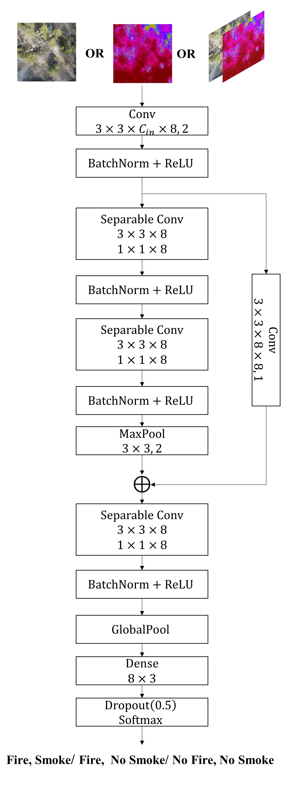
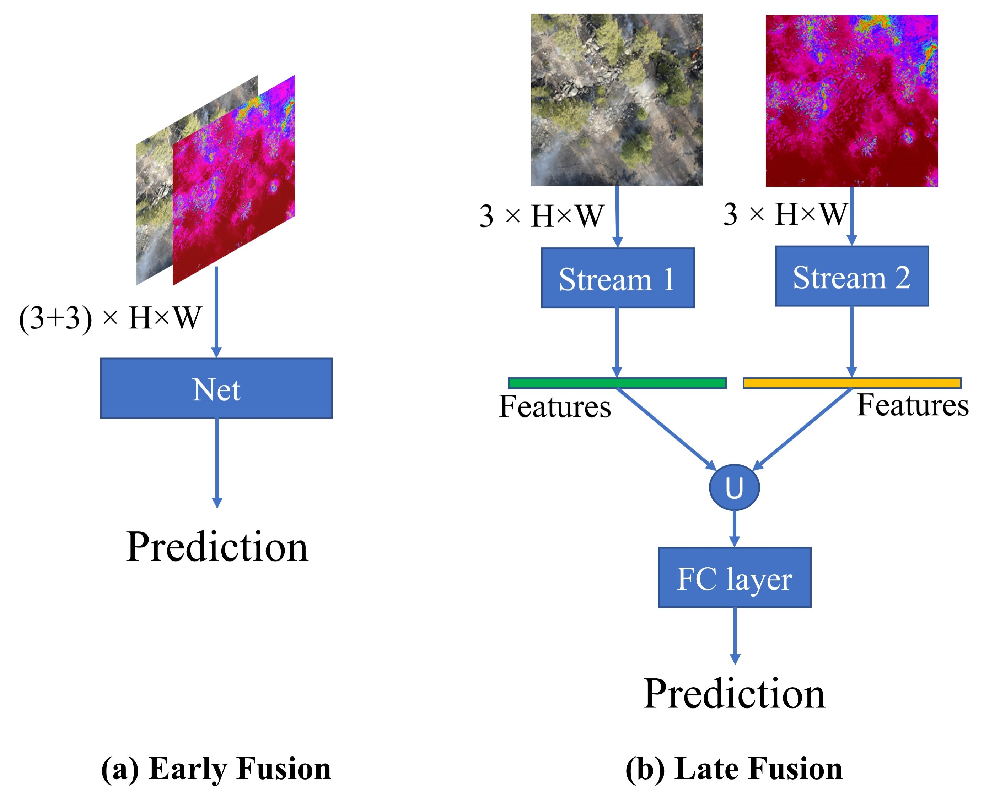
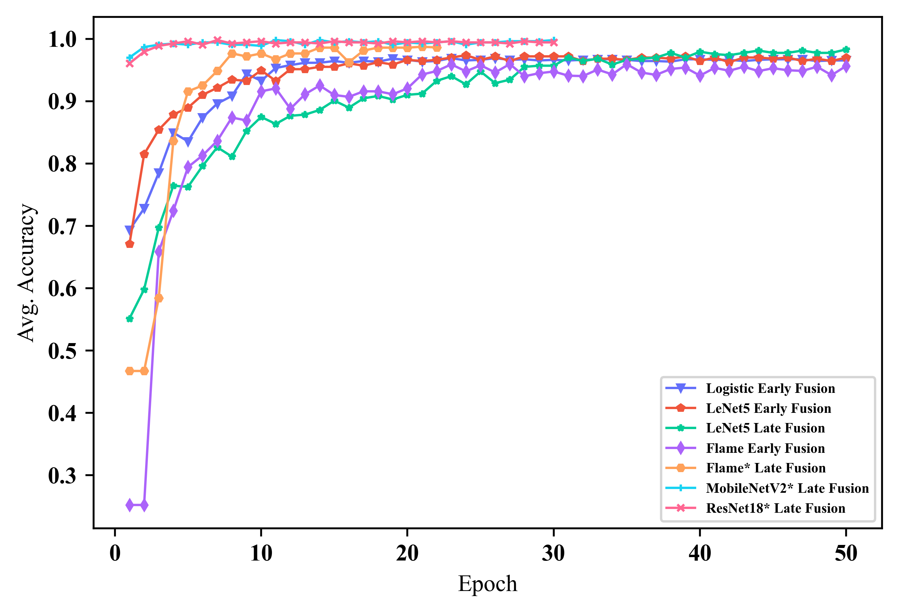
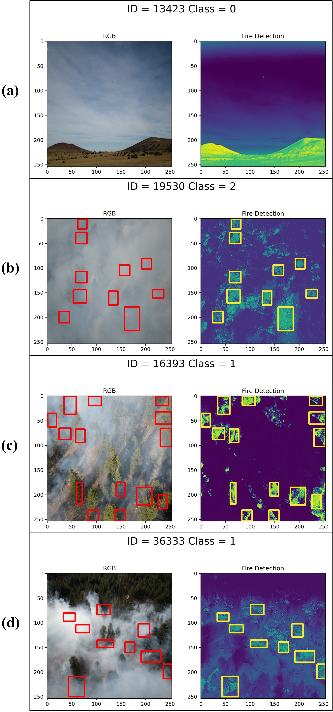

# Citation
<!-- [Paper link:](http://academicpages.github.io/files/paper3.pdf) -->

<!-- Recommended citation: Your Name, You. (2015). "Paper Title Number 3." <i>Journal 1</i>. 1(3). -->
Avalible datasets for now:

<a href="https://ieee-dataport.org/open-access/flame-2-fire-detection-and-modeling-aerial-multi-spectral-image-dataset">FLAME 2: FIRE DETECTION AND MODELING: AERIAL MULTI-SPECTRAL IMAGE DATASET</a>

<a href="https://ieee-dataport.org/open-access/flame-dataset-aerial-imagery-pile-burn-detection-using-drones-uavs">THE FLAME DATASET: AERIAL IMAGERY PILE BURN DETECTION USING DRONES (UAVS)</a>

More information, please reference our previous paper:
<a href="https://ieeexplore.ieee.org/abstract/document/8845309">Wildfire Monitoring in Remote Areas using Autonomous Unmanned Aerial Vehicles</a>

# Abstract
Current forest monitoring technologies including satellite remote sensing, manned/piloted aircraft, and observation towers leave uncertainties about a wildfire's extent, behavior, and conditions in the fire's near environment, particularly during its early growth. Rapid mapping and real-time fire monitoring can inform in-time intervention or management solutions to maximize beneficial fire outcomes. Drone systems' unique features of 3D mobility, low flight altitude, and fast and easy deployment make them a valuable tool for early detection and assessment of wildland fires, especially in remote forests that are not easily accessible by ground vehicles. In addition, the lack of abundant, well-annotated aerial datasets -- in part due to unmanned aerial vehicles' (UAVs') flight restrictions during prescribed burns and wildfires -- has limited research advances in reliable data-driven fire detection and modeling techniques. While existing wildland fire datasets often include either color or thermal fire images, here we present (1) a multi-modal UAV-collected dataset of dual-feed side-by-side videos including both RGB and thermal images of a prescribed fire in an open canopy pine forest in Northern Arizona and (2) a deep learning-based methodology for detecting fire and smoke pixels at accuracy much higher than the usual single-channel video feeds.  The collected images are labeled to "fire" or "no-fire" frames by two human experts using side-by-side RGB and thermal images to determine the label. To provide context to the main dataset's aerial imagery, the included supplementary dataset provides a georeferenced pre-burn point cloud, an RGB orthomosaic, weather information, a burn plan, and other burn information. By using and expanding on this guide dataset, research can develop new data-driven fire detection, fire segmentation, and fire modeling techniques.

# Background
This work presents a methodology for identifying and
mapping fire and smoke using high temporal and spatial-resolution observations from an integrated two sensor (mid-wave IR and visible bands) UAS-based imaging system. The paper also presents a unique dataset of side-by-side RGB/IR imagery collected during a prescribed fire near Flagstaff, Arizona in 2021 [20]. The images are jointly labeled by two human experts with fire/no-fire and smoke/no-smoke1 labels. In additional to aerial images, data on weather information, and georeferenced pre-burn point cloud data points are included in the dataset. It is expected that the methods developed to produce the FLAME2 dataset and others to follow can facilitate fire detection and modeling, as well as fire management.

## Supplemental Dataset - 2D View of Point Cloud
We prepared a supplemental dataset for public access and
future analyses, including a pre-burn georeferenced point
cloud and orthomosaic. In addition to the
photogrammetric products, we included a weather forecast,
burn plan, and external resources such as Light Detection
And Ranging (LiDAR) point clouds and Digital Elevation
Models (DEMs). The dense point cloud and orthomosaic
image of the site were generated using the pre-burn imagery
collected with the DJI M200 and analyzed with Agisoft
MetashapePro. Videos were parsed into images every
60 frames, resulting in 303 photos with sufficient overlap
for image alignment. The dense point cloud was generated
using structure-from-motion methods. Settings included
sequential image preselection, the "high" accuracy setting
for image alignment, and "high" quality point cloud. To
showcase of the point cloud’s potential uses, Fig. 5 depicts
a top-down 2D plot of the normalized preburn point cloud,
effectively mapping out canopy heights. The orthomosaic
was created from a digital elevation model sourced from the
point cloud with the "hole filling" setting enabled. Lastly,
the point cloud and orthomosaic were georeferenced using
the coordinates of natural features visible in the images and
satellite imagery. A mean error of 0.705 m and a resolution
of 7.6 cm/px were attained.

<!--  -->

# DL-Based Wildfire Classification
First, we applied some widely used machine learning and
deep learning classification models (i.e. "benchmarks"), in-
cluding Logistic Regression, LetNet(1989), Vgg(2014)
, MobileNet(2017), and ResNet(2016), to our
dataset, as well as our method. Note that Vgg, MobileNet, and ResNet
are pre-trained (i.e., each model has been trained on some
other datasets that have some prior knowledge to understand
the features of images, but the high-level features may not be
enough for the new task of fire detection). Then, we need
only modify some layers of the pre-trained models (their
"classifiers") and train the classifiers on our dataset; then,
those models can have good accuracy on our dataset.

<!--  -->

## RGB/IR Fusion
The input of the model can be only RGB images
(f (RGB; θ)) or IR images (f (IR; θ)) or we can benefit from
inputting both RGB and IR pairs (f (RGB, IR; θ)), where
f (·; θ) denotes the network mapping function parameterized
by θ. When inputting RGB-IR pairs, we consider two simple
approaches to perform feature fusion, named
Early Fusion and Late Fusion. Specifically, in Early Fusion,
we simply concatenate the paired images and modify the
number of channels of the input of the first layer from 3
to 6. In Late Fusion, either RGB or IR will be fed to two
streams with the same architecture (i.e. the left stream learns
from the RGB domain while the right stream learn from the
IR domain). We then concatenate the extracted features from
each stream and feed the fused feature to a fully-connected
layer to perform classification. Thus, subsequent layers can
learn the high-level representation from both RGB and IR
domains.

# Experimental Results

## Fire Classification
We perform ten experiments for each model. We use the
ADAM optimizer with 1e−3 learning rate for the Flame
network, and 1e−4 for the other models. The batch size is set
to 64, considering the label smoothing with probability 0.2
is used in the training phase. To achieve a fair comparison,
we train the models that learn from scratch with 50 epochs,
and the pre-trained models with 30 epochs. Besides focusing
on the accuracy of the classification, we are more interested
in the macro-level metrics, such as macro F1 score, macro
recall, and macro precision

## Flame Detection
A Maximally Stable Extremal Regions (MSER) method
was applied to detect the image blob features and then generate 
bounding boxes for detected features. As in many other
object detection applications, the MSER method usually
generates many partially overlapping bounding boxes for the
same object. One simple solution to avoid many unnecessary
calls and achieve more precise localization of the fire flames
would be using Non-Maximum Suppression (NMS) method
to eliminate the overlapping bounding boxes in favor of the
strongest one. By fine-tuning the suppression processes of
non-maximum parameters and the threshold of pixel intensity
(fire-line) on IR images, the algorithm identifies areas with
higher probability to contain fire. Figure 8 shows the result of
flame detection, where the flame detection’s accuracy is not
affected by smoke. Thus, our proposed framework is simple,
stable, computationally efficient, and labor-free.

<!--  -->

## Flame Images Generating
This module uses GAN-based deep learning method to generate RGB flame images from given IR image. For example, input an arbitrary IR image of wildfire, the model will generate a virtual RGB image to describe the fire situation.

This part is only on experimental stage, but it's good to research the relationship between the wildfire and its smoke. We will keep researching on this topic in future.

<!--  -->

# Contributing
This project is contributed by: 

<a href="xiwenc@g.clemson.edu">Xiwen Chen</a>

<a href="bryceh@g.clemson.edu">Bryce Hopkins</a>

<a href="hao9@g.clemson.edu">Hao Wang</a>

Leo O'Neill

<a href="fafghah@clemson.edu">Fatemeh Afghah</a>

<a href="arazi@clemson.edu">Abolfazl Razi</a>

<a href="pete.fule@nau.edu">PeterFule</a>

<a href="janicec@ucar.edu">Janice Coen</a>

<a href="eric.rowell@dri.edu">Eric Rowell</a>

<a href=" Adam.Watts@usda.gov">Adam Watts</a>

## Please cite our work if you think this project helps your research.

Avalible datasets for now:

<a href="https://ieee-dataport.org/open-access/flame-2-fire-detection-and-modeling-aerial-multi-spectral-image-dataset">FLAME 2: FIRE DETECTION AND MODELING: AERIAL MULTI-SPECTRAL IMAGE DATASET</a>

<a href="https://ieee-dataport.org/open-access/flame-dataset-aerial-imagery-pile-burn-detection-using-drones-uavs">THE FLAME DATASET: AERIAL IMAGERY PILE BURN DETECTION USING DRONES (UAVS)</a>

More information, please reference our previous paper:
<a href="https://ieeexplore.ieee.org/abstract/document/8845309">Wildfire Monitoring in Remote Areas using Autonomous Unmanned Aerial Vehicles</a>

